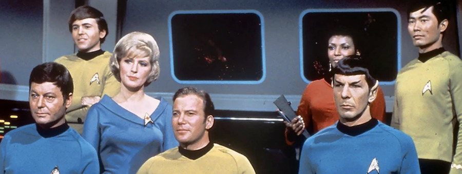
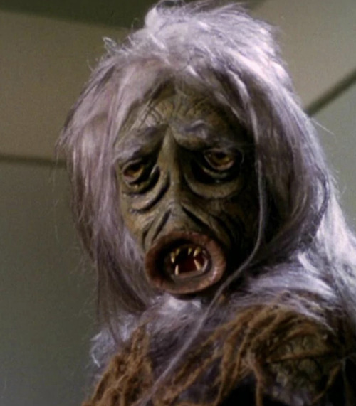

*Este post forma parte de una serie sobre el [revisionado completo de todo Star Trek](./viendo-star-trek-¿como-cuando-y-por-que/), 
es recomendable empezar por ahí*.{.textright}

Pues entramos en harina. Después de ver el piloto perdido no aprobado por la cadena, empezamos con la primera temporada propiamente dicha. *Spoilers ahead*, obviamente, pero que esto tiene ya casi 60 años desde que se emitió por primera vez.

## The Man Trap (s01e01)

Por fin el elenco definitivo de la serie original, **William Shatner** como el *Capitán Kirk*, **Leonard Nimoy** como el primer oficial *Doctor Spock* y **DeForest Kelley** como el médico *Leonard "Bones" McCoy*, como personajes principales. Aparecen como secundarios en este episodio varios de los futuros protagonistas: **George Takei** como el piloto *Hikaru Sulu* y **Nichelle Nichols** como la oficial de comunicaciones *Nyota Uhura*. Nos faltan por ahora *Scotty* y *Chekov*. Qué cosa más bonita de tripulación.

{.right style=max-width:40%} La *Entreprise* llega a un planeta remoto a proporcionar los obligatorios exámenes médicos de la Federación a sus dos únicos habitantes: un arqueólogo y su esposa. En seguida se tuerce la situación cuando los espectadores vemos que cada personaje percibe a la mujer como una persona diferente. ¡Ups! Algún tipo de cambiaformas, y se infiltra en la *Enterprise*. Pobre McCoy, que pensaba que iba a visitar a un antiguo amor de juventud.

Tremendo esto, me ha encantado. Con un poco de *corchopán* y decorados de obra de teatro de colegio ya tienes en 1966 montado el inicio de una franquicia interminable.

> *Curiosidad del día*: *Sulu* es una palabra difícil de pronunciar en japonés, por lo que en algunos de los doblajes nipones *Sulu* se llama *Kato*.
