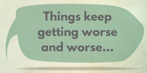
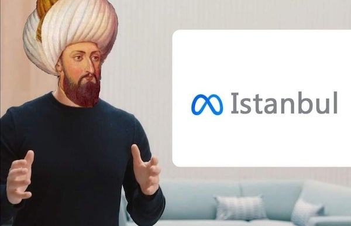

La semana pasada (la cuarta del año) estuve bastante ocupado con asuntos del Mundo Real™, así que hubo poco tiempo internetero y, por tanto, poco que resumir. Esta semana retomamos la actividad:

- [Hace poco](/nada-importa/) mencionaba la [lista de correo Nada Importa](https://nadaimporta.substack.com/) de **Jesús Terrés**, y esta semana ha vuelto a sorprenderme con:

  > La felicidad es el talento para gestionar la distancia entre lo que se desea y lo que se tiene.

  Directo a las entrañas.

- Curioso tema el de este [artículo del **New York Times**](https://www.nytimes.com/2023/01/25/business/layoffs-remote-work.html) acerca de cómo es perder tu trabajo ahora que muchos están/estamos trabajando en remoto, sin tener contacto con compañeros. Esta frase concreta también ha sido bastante directa: 

  > “I don’t have any expectation for any company I work for to prioritize my interests”

  {.right width=50%}
  
  Empresas que han tenido beneficios millonarios despiden a decenas de miles de trabajadores en todo el mundo, y a todos nos parece normal. No cogemos las picas y antorchas. Explica el artículo que cuando Nokia tuvo que reestructurarse en 2011, dio un aviso de un año a cerca de 18.000 trabajadores, a los que ayudó durante todo ese tiempo a recolocarse dentro de la empresa o en otro lugar. No estamos yendo a mejor.

- Un larguísimo (como hace siempre) [artículo de **Cory Doctorow**](https://pluralistic.net/2023/01/21/potemkin-ai/#hey-guys) acerca de la *enshittification* (¿el enmierdamiento?) de las plataformas, de donde saco píldoras que merecerían enmarcarse:

  > "Monetize" is a terrible word that tacitly admits that there is no such thing as an "Attention Economy." You can't use attention as a medium of exchange. You can't use it as a store of value. You can't use it as a unit of account. Attention is like cryptocurrency: a worthless token that is only valuable to the extent that you can trick or coerce someone into parting with "fiat" currency in exchange for it. You have to "monetize" it – that is, you have to exchange the fake money for real money.
  
  > Google Search was based on principles set out in founder Larry Page and Sergey Brin's landmark 1998 paper, "[Anatomy of a Large-Scale Hypertextual Web Search Engine](http://ilpubs.stanford.edu:8090/361/)," in which they wrote, "Advertising funded search engines will be inherently biased towards the advertisers and away from the needs of consumers."
  
  > For many years, even Tiktok's critics grudgingly admitted that no matter how surveillant and creepy it was, it was really good at guessing what you wanted to see. But Tiktok couldn't resist the temptation to show you the things *it* wants you to see, rather than what *you* want to see. The enshittification has begun, and now it is unlikely to stop.
  
  Por una casualidad de los *clicks*, he llegado también a este otro artículo suyo de Diciembre: ["Metaverse" means "Pivot to Video"](https://doctorow.medium.com/metaverse-means-pivot-to-video-adbe09319038). Son textos largos para leer cuando tengáis un rato, pero 100% recomendables acerca de la situación actual de las plataformas sociales en *el Internet*. 

{width=70%}

*Meta meme*.{.center}

- En la nueva guerra de las redes sociales, *start-ups* con rondas de financiación millonarias que quieren hacer lo mismo que hace/hacía **Twitter** (de **Mastodon** no hace falta hablar, ya lleva mencionándose y existiendo mucho tiempo):
  - [**Damus**](https://damus.io/), basada en un nuevo protocolo de múltiples servidores llamado [nostr](https://nostr.com/). Esto me llama la atención, pero no lo suficiente como para utilizarlo.
  - [**T2**](https://t2.social/) (no se han roto la cabeza con el nombre), ha recibido 1.1M$.
  - [**Spill**](https://www.spill-app.com/), creada por un *ex-Twitter*, ha recibido 2,75M$.
  
  Mi pronóstico de analista tecnológico es: Las probabilidades de llegar al año son escasas.

