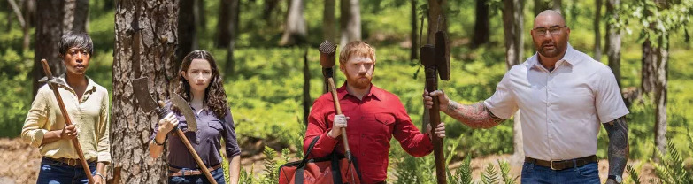
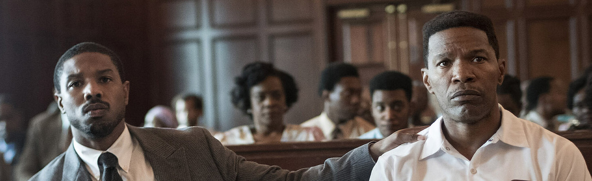

Recuperamos la tradición de las [reseñas cinematográficas relámpago](/tags/resenas-cinematograficas-relampago/), en la que [sería la entrada número XXXI](/resenas-cinematograficas-relampago-xxx/), pero lo de llevar la cuenta se hace cansino, así que lo dejamos.

## [You People](https://letterboxd.com/film/you-people-2023/) (*La gente como vosotros*, 2023)

*Ñé*. Buenismo bien para tratar los temas raciales de los estadounidenses, pero todo muy edulcorado. Mira que me gustan **Jonah Hill** y **Eddie Murphy** (que aquí tiene un papel muy seriote), pero aún así no ha conseguido parecerme más que prescindible. Una producción del nivel de Netflix, y ya está todo dicho.

## [I came by](https://letterboxd.com/film/i-came-by/) (*Pasaba por aquí*, 2022)

Si la anterior era prescindible, otra. Me dormí media hora viéndola y no me perdí nada, el final fue perfectamente entendible. Sólo destaco que me ha hecho gracia ver a **Hugh Bonneville** en un papel de villano enfermizo cuando en mi mente sólo puedo relacionarle con *Robert Crawley*, el muy honorable *Earl de Grantham* en **Downton Abbey**.

## [Knock at the Cabin](https://letterboxd.com/film/knock-at-the-cabin/) (*Llaman a la puerta*, 2023)

Me da igual lo que me digáis, yo sigo siendo *Team* **M. Night Shyamalan**. Una de las escasas vueltas al cine del último año, donde cada vez veo las salas más vacías sin importar la película, el cine o el pase al que vayas. Como todo lo de **Shyamalan**, una impecable factura técnica, planos tensos y sostenidos, desconocimiento de lo que puede ocurrir hasta el final de la película, y... y una sensación al final de "*pues tampoco me has contado nada*". Vale la pena por el viaje, no por la historia.

## [Just Mercy](https://letterboxd.com/film/just-mercy/) (*Cuestión de Justicia*, 2019)

La historia del primer preso en el corredor de la muerte en el estado de **Alabama** que acabó demostrando su inocencia y siendo puesto en libertad. Correcto **Michael B. Jordan**, muy bien **Jamie Foxx**. Le sobra fácilmente media hora de metraje y, puestos a recomendar, me parece casi más recomendable los títulos de crédito en los que hablan de los personajes reales en los que está basada la película, y se dan algunas cifras escalofriantes.
