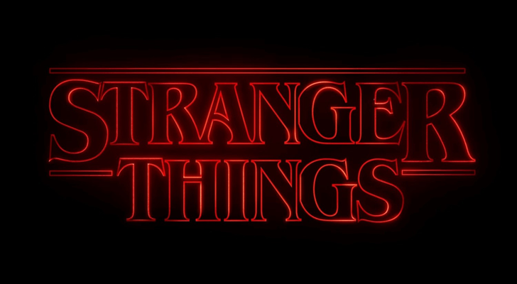

Mis mitomanías televisivas por décadas: 

- Los 90 de [The X-Files](https://en.wikipedia.org/wiki/The_X-Files).
- Los 2000 de [Lost](https://en.wikipedia.org/wiki/Lost_(TV_series)).
- Los 2010 de [Game of Thrones](https://en.wikipedia.org/wiki/Game_of_Thrones).
- Y después, en la era del *streaming*, ¿qué?... ¿[Stranger Things](https://en.wikipedia.org/wiki/Stranger_Things)? ¿[The Mandalorian](https://en.wikipedia.org/wiki/The_Mandalorian)?

Sí, entiendo que **Stranger Things** pueda estar uno (o varios) peldaños por debajo para la mayor parte de los espectadores, pero en mi humilde (pero infalible) opinión, si se hubiera distribuído a un ritmo de episodio semanal igual que las anteriores, muy probablemente hubiese eclipsado cualquier otro estreno durante sus años y habría dominado (aún más) el *zeitgeist* televisivo de los últimos tiempos.

Hay muchas razones buenas y malas para discutir acerca de los ritmos de estrenos y las retransmisiones, y seguro que es más cómodo consumir como el espectador desea, pero no podemos negar que el impacto se diluye sobremanera. Netflix no ha sabido explotar esto, que HBO siempre supo y Disney+ sí ha entendido aún llegando mucho tiempo después.

{.right}

Creo que ya lo he comentado anteriormente en otros lugares: sé que es una trampa fácil caer en la **nostalgia de los ochenta**, porque los que estamos en los *cuarentaytantos* estamos en un sector de consumo muy apetecible, por capacidades adquisitivas, por desapego con muchas producciones culturales actuales, por el falso "*lo de antes siempre fue mejor*" y porque, obviamente, si apelamos a un tiempo en el que teníamos diez años es obvio que en nuestro recuerdo los tiempos eran mejores, porque... lo eran. Cero problemas y cero responsabilidades. 

Cuando recuerdas algo, hay una parte de tu cerebro que no sabe distinguir si está sucediendo ahora mismo o no. Si recuerdas algo feliz, sientes una fracción de esa felicidad. Si te ponen música de los 80, estilos visuales de los 80, y temáticas de los 80, y tenías ocho años en aquel entonces, es muy complicado que la nostalgia no te de una suave bofetada envuelta en un guantelete de acero de diez kilos.

Pero yo aquí venía a hablar de mi libro. He *consumido* cada una de las temporadas de **Stranger Things** en su momento, con la consabida expectación previa. Pero con esta última, la cuarta, no he podido hacerlo. Una larga pausa desde el 2019 de la tercera temporada hasta el 2022 de la cuarta, durante la que **pasaron un montón de cosas en nuestro mundo real**, ¿os acordáis? Algo le ha sucedido a mis procesos mentales durante estos años, en los que muchas cosas se han diluído en el recuerdo, como si hubiera pasado una década en vez de los tres años reales. Lo cierto es que no recordaba *nada*. Me está pasando con muchas cosas, con libros, películas y series... los argumentos se diluyen y confunden, y sólo guardo tenues recuerdos de las líneas generales.

Y esto, con mi queridísimo piscis, quiero decir, **Stranger Things**, no podía ser. Quería ver la nueva temporada como debe ser, recordando cómo habíamos llegado hasta aquí y pudiendo disfrutar cada momento. Y me ha costado meses encontrar el hueco para poder volver a ver las tres temporadas que ya existían. Así que... aquí estamos.

[Revisionado de Stranger Things](/tv/stranger-things).{.center}

Let's go.
