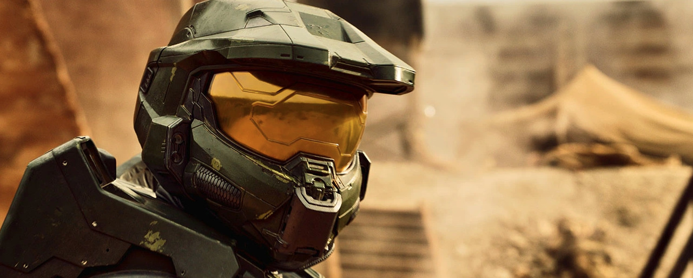

Estoy a tope últimamente con las series de ciencia-ficción, y no consigo dar con nada que me llene mínimamente, salvo los revisionados de series clásicas y/o ya contrastadas en calidad. Es que no sé ya ni por donde tirar.

### [Extrapolations](https://www.themoviedb.org/tv/138169-extrapolations) (AppleTv+, 2023, 8 episodios)

Miniserie autocontenida, que siempre está bien. Historias parcialmente relacionadas, con algunos personajes comunes, que nos cuentan posibles resultados de la deriva climática de este, nuestro planeta, a lo largo de las próximas décadas. Algunos actores chachis, otros meh, argumentos que te llevan de la manita con músicas de fondo para dejarte claro cómo tienes que sentirte en cada momento. Que está bien, pero... misma sensación que con [Don't Look Up](https://letterboxd.com/film/dont-look-up-2021/), si me lo edulcoras todo tanto el mensaje se diluye, e incluso llega al punto de empezar a provocar rechazo, narrativamente hablando: "*a ver si acaba esto ya*".

### [Halo](https://www.themoviedb.org/tv/52814-halo) (2022, Paramount+, 1ª temporada) 

Soy **muy** fan de la saga de videojuegos. Creo que hay ahí un trasfondo galáctico y una historia fantástica para ser contada... pero no es esta. Tarda poco en llegar el momento en el que nuestro protagonista se quita el casco y podemos ver que el argumento de la serie va a estar centrado en una persona y no en una situación. 

Nos debería dar igual quién es el *Master Chief*. Llevamos tres temporadas de **The Mandalorian** y hemos sabido tres cosas del *mandalorino*, y le hemos visto la cara cinco minutos, y ni falta que hace. Pero en esta serie no nos están contando la historia de los videojuegos, sino una especie de precuela alternativa (*Silver Timeline* han llamado a esta versión), y tenemos un personaje que no actúa como lo hemos hecho todos con el mando de la consola, tenemos secundarios metidos con calzador para contarnos otras historias en otros planetas que nos dan igual, y tenemos... **ojo, posible spoiler**, una historia romántica que no logro entender cómo a quien levantó la mano en una reunión de guionistas para proponerla no lo tiraron por la ventana.

Pero lo cortés no quita lo valiente, y casi me pongo en pie en las pocas escenas que tiene la temporada que sí tienen relación con el juego y son prácticamente calcadas, al grito de "*¡Eh, que yo he hecho eso también!*".

Aceptable con reticencias para fans de la franquicia. Un rotundo **no** para el público general.

### [The Big Door Prize](https://www.themoviedb.org/tv/194704-the-big-door-prize) (AppleTv+, 2023, 1ª Temporada)

Ojo aquí. En la línea de la casa de *AppleTv+*, *cozy series*, te deja con buen sabor, hay algo de suspense y algo de comedia. No es brillante pero lo bastante correcta como para atreverme a recomendarla, y el último episodio me sorprendió mucho.

En un pueblecito donde nunca pasa nada aparece un día una máquina expendedora de una tarjeta que te dice cuál es tu potencial en la vida: ser una estrella de cine, un chef, un profesor o un reponedor de supermercado. Y, sin saber si está acertando o no, esto empieza a provocar cambios en el pueblo.

Yo siempre seré fan de [**Chris O’Dowd**](https://www.imdb.com/name/nm1483369/), por cosas como [The IT Crowd](https://www.themoviedb.org/tv/2490-the-it-crowd), [Frequently Asked Questions About Time Travel](https://www.imdb.com/title/tt0910554/) (un joven *yo* escribió [aquí](/resenas-cinematograficas-relampago-v/) sobre ella en el 2009), o [State of the Union](https://www.themoviedb.org/tv/87984-state-of-the-union).

### [Moonhaven](https://www.themoviedb.org/tv/125398-moonhaven) (amc+, 2022, 1 temporada y cancelada)

No.

Parezco nuevo. Decorados de cartón piedra, efectos de baratillo, parece una producción del canal *Sci Fi* de los 90. Las premisas hay que cogerlas con pinzas, los actores son bastante malos y ya en el primer episodio de intuye que esto no va a ir a mejor. Pero un *cliffhanger* curioso me hizo avanzar (son sólo seis capítulos), para terminar en nada y ver que ha sido cancelada. Y eso que [**Joe Manganiello**](https://www.imdb.com/name/nm0542133/), pese a ser un actor terrible, siempre me hace gracia...

No gastéis tiempo en esto.

### [The Expanse](https://www.themoviedb.org/tv/63639-the-expanse) (SyFy primero, Amazon Prime video después, 2015-2021, 6 temporadas)

Emociones encontradas aquí. Es la segunda vez que intento verla (tuve que volver a empezar desde el principio porque no recordaba nada), y me he vuelto a parar, esta vez en algún momento de la quinta temporada.

Hay cosas muy decentes aquí, de [*Ci-Fi Hard*](https://en.wikipedia.org/wiki/Hard_science_fiction), que la ponen bastante por encima de la media. Pero luego vemos otros detalles, y unas actuaciones lamentables, que quitan las ganas de continuar.

Intentaré terminarla, pero me están entrando más ganas de leer los libros que de seguir viendo episodios.
