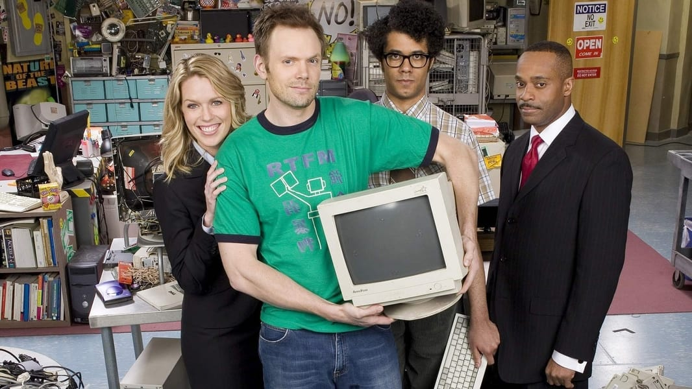

Decía hace poco, [hablando de **The Big Prize Door**](/movidas-catodicas-ciencia-ficcion-televisiva/), que era fan de [**Chris O'Dowd**](https://www.imdb.com/name/nm1483369/) desde sus tiempos en [**The IT Crowd**](https://www.imdb.com/title/tt0487831/). Y ha querido la casualidad que, buscando información acerca de la serie, recordase que se intentó hacer una [versión americana](https://www.themoviedb.org/tv/43207-the-it-crowd) de [la serie británica](https://www.themoviedb.org/tv/2490-the-it-crowd).

Sólo se hizo un piloto que no llegó a ninguna parte, que [puede verse online en el *Internet Archive*](https://archive.org/details/the-it-crowd-us-pilot).

<iframe src="https://archive.org/embed/the-it-crowd-us-pilot" width="640" height="480" frameborder="0" webkitallowfullscreen="true" mozallowfullscreen="true" allowfullscreen></iframe>

No sé quién tuvo la idea de usar a [**Joel McHale**](https://www.imdb.com/name/nm0570364/) para el papel de *Roy*, pero creo es una de las peores decisiones de *casting* que he presenciado en la vida. Y eso que [**Richard Ayoade**](https://www.imdb.com/name/nm1547964/) repetía papel en ambas versiones.

Curioso [este otro video en YouTube](https://www.youtube.com/watch?v=YUdGpkdksKE) donde se sincronizan ambas series, que son repeticiones plano por plano con distintos actores.
