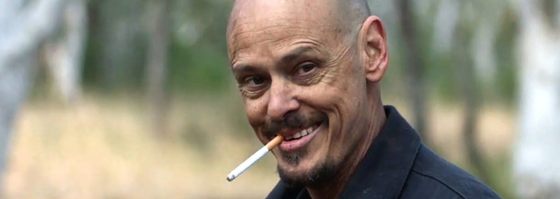
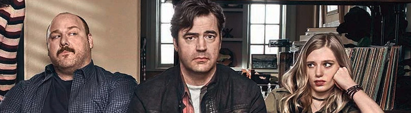

### [Bupkis](https://thetvdb.com/series/bupkis) (*Peacock*, 2023, 8 episodios)

[**Pete Davidson**](https://en.wikipedia.org/wiki/Pete_Davidson) está siempre en la fina línea que hay entre la grandeza y que nos olvidemos de él para siempre. Tiene algún monólogo bastante brillante en plataformas de *streaming*, alguna película ya como protagonista, y ahora una serie creada por y para él, haciendo de sí mismo en una dramatización de su vida actual que... en ocasiones hasta nos la creemos, porque el pobre tiene toda la pinta de ser así.

Pero es que está **Joe Pesci**, que ya se había retirado, **Edie (*Carmela Soprano*) Falco**, y empiezan a aparecer de cuando en cuando una lista de actores y personajes bastante sorprendente: parte del elenco de *Everybody loves Raymond* (incluyendo a **Ray Romano**), **Bobby Cannavale**, **Steve Buscemi**, **Simon Rex**, **Jon Stewart**, **Al Gore**, **John Mulaney**, **Machine Gun Kelly**... qué sé yo, mucha gente.

Y el conjunto es curioso, pero... algo no me engancha aquí. Según la Wikipedia: *The show is described as a "heightened fictionalized version of Pete Davidson's life", and has been compared to [Louis C.K.](https://en.wikipedia.org/wiki/Louis_C.K.)'s [Louie](https://en.wikipedia.org/wiki/Louie_(American_TV_series)) and [Larry David](https://en.wikipedia.org/wiki/Larry_David)'s [Curb Your Enthusiasm](https://en.wikipedia.org/wiki/Curb_Your_Enthusiasm).* Pero no sé yo. Es que se me queda en tierra de nadie. Desde luego si el actor/personaje no es de vuestro rollo, no lo intentéis.

### [Mr. InBetween](https://thetvdb.com/series/mr-inbetween) (*FX*, 2018, 4 temporadas)

Un matón a sueldo de lo que vaya surgiendo, pero contado casi desde lo que podría ser un *slice of life*. Sus *movidas*, sus asuntos, sus *vainas*. Padre divorciado, gestionar las visitas de su hija, conocer a una nueva pareja... y entre medias *reventar* a alguien por orden de algún mafiosillo de medio pelo, y las consecuencias que todo ello va teniendo.

Sobre el papel tiene todo lo que podría interesarme (esos *matones-que-nos-gustan-cuéntame-más* que tanto me atrapó con *Sons of Anarchy*, por ejemplo, aunque con más humor negro aquí), pero a la hora de aterrizarlo no me ha terminado de enganchar y creo que se va a quedar en haber visto la primera temporada.

La serie es australiana, por cierto, por si de primeras os chocan los acentos de los actores. Por culturilla general: es una serialización de una película del 2005 que fue escrita, dirigida y protagonizada por el señor de la foto, [**Scott Ryan**](https://en.wikipedia.org/wiki/Scott_Ryan_(actor)), que aquí vuelve a escribir y protagonizar.

### [Loudermilk](https://thetvdb.com/series/bupkis) (*AT&T Audience*, *Amazon Prime Video*, 2017, 3 temporadas)

Yo de [**Ron Livingston**](https://en.wikipedia.org/wiki/Ron_Livingston) lo acabo viendo todo, y después de mi enésimo revisionado de [Office Space](https://letterboxd.com/film/office-space/) me puse a buscar en qué había estado este señor los últimos años (acabo de ver también su breve papel en [The Flash](https://letterboxd.com/film/the-flash/), por cierto), y apareció esto.

Una serie creada por [**Peter Farrely**](https://en.wikipedia.org/wiki/Peter_Farrelly) (la mitad de los [Hermanos Farrely](https://en.wikipedia.org/wiki/Farrelly_brothers)) obligatoriamente va a tener muchas cosas interesantes de ver... y en este caso las tiene. Casi hasta el secundario más ridículo, apenas un personaje cliché, acaba teniendo algún episodio centrado en él que te deja con la boca abierta. Hay temas duros (*Sam Loudermilk*, el personaje protagonista, es un ex-alcohólico que ahora hace de cínico consejero para un grupo de adictos), que a veces parecen cómicos y a veces parecen serios, aunque en la tragicomedia creo que caemos más de lado trágico que del cómico muchas veces, para enderezarse unos minutos después.

Dos temporadas en la plataforma de *AT&T* hasta que la cerraron, la tercera se emitió en *Prime Video* y al terminar ha quedado en un limbo del que nada se sabe. Quizá se quede ahí, porque la serie se mueve siempre en un estrecho margen entre la calidad y el tedio, y parece que nunca termina de despegar y alcanzar las cotas que promete. Recomendable pero con reticencias, podéis probar a ver un par de capítulos y valorar.

