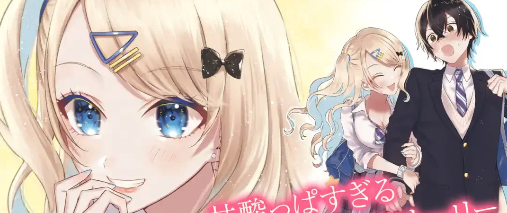
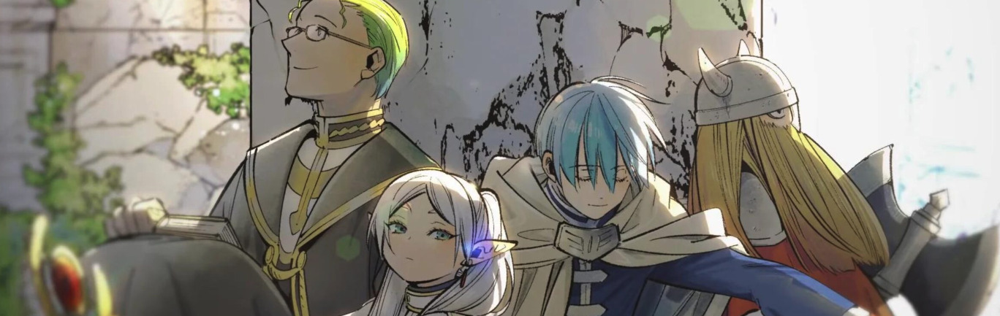
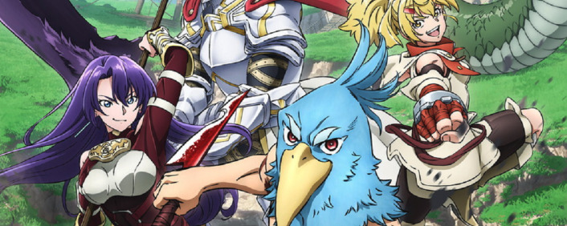

Apuntes rápidos sobre algunas de las series de anime que empiezan en esta nueva temporada.

## Keikenzumi na Kimi to, Keiken Zero na Ore ga, Otsukiai Suru Hanashi

Buscando alguna nueva historia romántica sencilla para acompañar las tardes de otoño, me ha dado por probar... vamos allá... 経験済みなキミと、経験ゼロなオレが、お付き合いする話。, ***Keikenzumi na Kimi to, Keiken Zero na Ore ga, Otsukiai Suru Hanashi***, "You Were Experienced, I Wasn't, And This is How We Started Dating".

Con estos títulos es imposible decir "*he empezado a ver <título>*", así que es más fácil que nos entendamos usando el sobrenombre de [**Kimizero**](https://en.wikipedia.org/wiki/You_Were_Experienced,_I_Was_Not:_Our_Dating_Story).

Le he concendido tres capítulos y medio, hasta el primer *girito* argumental, pero ni con esas se me ha hecho soportable. El diseño y la animación son de tercera fila, y la historia se me aparece demasiado manida, yendo a lo fácil. Tendré que seguir buscando, *next*.

## *Sōsō no Furīren*

[**Frieren**](https://en.wikipedia.org/wiki/Frieren) sin embargo me ha llegado con sólo un capítulo visto por ahora. Claro que está basado en un manga de relativo éxito (con lo que el dibujo siempre será mejor), y el anime viene firmado por [Madhouse](https://en.wikipedia.org/wiki/Madhouse_(company)).

葬送のフリーレン, ***Sōsō no Furīren***, "Frieren, the Final Farewell to the Dead".

Cuando vi el anuncio de este nuevo anime, creo recordar que ya hace unos meses, le di un tiento online a los primeros capítulos del manga, a ver de qué iba esto, y sabía que probablemente me iba a gustar.

Muy emotivo ese comienzo contándonos lo rápido que envejece un grupo de aventureros, pasando las décadas como si sólo fueran semanas para la elfa protagonista. Muy buena animación, preciosa música. Recomendable.

## *Shangri-La Frontier*

Un muchacho acostumbrado a jugar a videojuegos lamentables empieza a jugar a un juego *online* bueno. Ya está. Esa es la premisa. En la línea de los *Isekai-tangenciales* (término que acabo de inventarme): no es un protagonista que llega a un nuevo mundo pero, metafóricamente, es como si lo fuera.

Si haces estas cosas de machacar teclas y botones online le verás la gracia (*I'm in*), si no, lo veo complicado.

## En la recámara

Estoy probando, sin decidirme todavía:

- [*Bōshoku no Beruseruku*](https://en.wikipedia.org/wiki/Berserk_of_Gluttony), *Boushoku no berserk*, ***Berserk of Gluttony***, como lo veáis escrito.
- En breve empiezo con la segunda temporada de [Goblin Slayer](https://en.wikipedia.org/wiki/Goblin_Slayer), quiero tener cápitulos de margen.
- [*Toaru Ossan no VRMMO Katsudōki*](https://en.wikipedia.org/wiki/A_Playthrough_of_a_Certain_Dude%27s_VRMMO_Life), ***A Playthrough of a Certain Dude's VRMMO Life***, esta creo que no va a pasar mi gillotina personal, después de un par de capítulos no la veo al nivel exigido, pero está por confirmar. Tiene una premisa muy similar a *Shangri-La Frontier*, pero centrándose en partes mucho menos (a priori) interesantes de la experiencia de un juego *online*.
