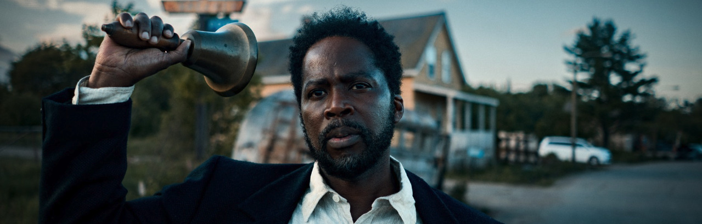
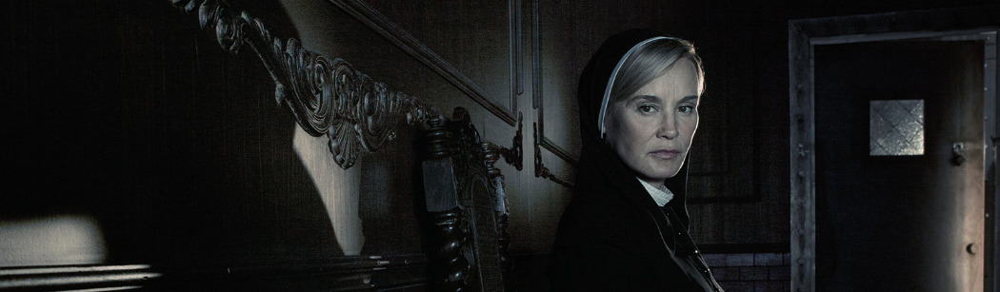
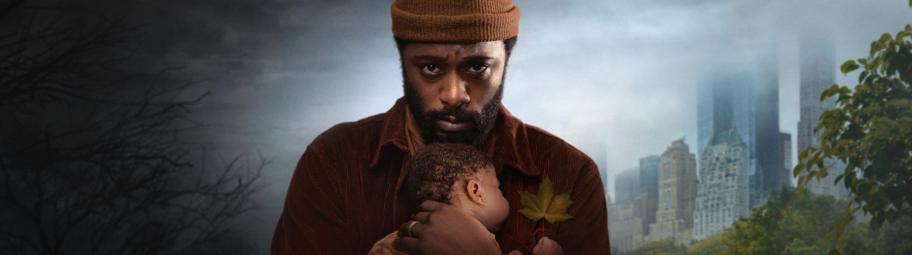
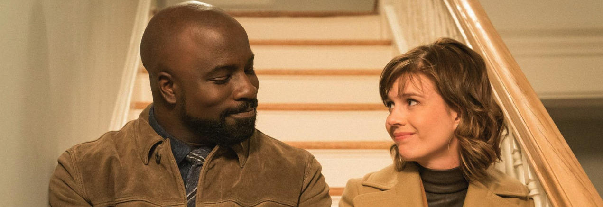

Si es que a mí me das un misterio y ya me tienes más entretenido que [dándole a un tonto una tuneladora](/tuneles-y-tuneladoras/). Veo desde la barrera, no con poca envidia sana, a los aficionados al cine de terror, que tantos y tantos estrenos tiene cada año, porque en cuanto hay dos sustos la tensión no me deja disfrutar... soy incapaz, qué le voy a hacer. Pero si mantienes esos momentos en un suspense contenido, sin llegar a *acongojar* al espectador, allá que voy de un salto.

### [From](https://thetvdb.com/series/from) (*MGM+*, 2022, 2 temporadas)

Tenemos aquí a [**Harold Perrineau**](https://www.imdb.com/name/nm0674782/) para contarnos un nuevo [**Lost**](https://thetvdb.com/series/lost). Un pequeño pueblo al que llega la gente por carretera y, una vez allí, ya no pueden salir. Y al caer la noche *pasan cosas*.

Ya tuve miedo de que la cancelaran al terminar la primera temporada, por enrevesarse demasiado y perder audiencia, aunque para mi sorpresa ha habido una segunda. Para mi *no-sorpresa*, esta segunda ha complicado aún más las cosas, haciéndome temer que no haya nadie al volante y sólo llevemos el dial de los misterios al 11, hasta que no sepamos cómo solucionarlos.

Pero, por ahora, *I'm in*.

### [American Horror Story](https://thetvdb.com/series/american-horror-story#general) (*FX*, 2011, 12 temporadas)

Me sorprendo a mí mismo, tras tantos años de escuchar recomendaciones sobre **American Horror Story**, empezándola  a estas alturas desde cero. Que son ya 12 temporadas seguidas, pero allá vamos. 

Ayuda mucho que la serie sea una *antología de series*, cada temporada es una historia distinta, con distintas premisas, personajes, localizaciones y hasta momentos históricos. Muchos actores se mantienen, sí, pero haciendo papeles distintos de una a otra y teniendo mayor o menor peso en la narración.

He terminado las dos primeras, y *a tope con esto*. Espectacular [**Jessica Lange**](https://www.imdb.com/name/nm0001448/) comiéndose la cámara en cada escena.

### [The Changeling](https://thetvdb.com/series/the-changeling) (*Apple TV+*, 2023, 1 temporada)

Ya había escrito este *post*, cuando he caído en que aún me falta por ver el último capítulo de la temporada, así que no estoy seguro de si es una obra cerrada, o tendrá continuación.

En cualquier caso, absoluta recomendación, con una fantástica atmósfera en todo momento. Últimamente estoy viendo unas cuantas cosas de [**LaKeith Stanfield**](https://www.imdb.com/name/nm3147751/) y siempre quedo contento con su interpretación. *Recordatorio para mí mismo*: tengo que escribir sobre [**Atlanta**](https://thetvdb.com/series/atlanta).

### [Evil](https://thetvdb.com/series/evil) (*Paramount+*, 2021, 3 temporadas)

Un sacerdote atribulado ([**Mike Colter**](https://www.imdb.com/name/nm1591496/)) convence a una psiquiatra escéptica ([**Katja Herbers**](https://www.imdb.com/name/nm1126156/)) para que la ayude a investigar casos de posesiones, exorcismos, y un divertido etcétera. A la fantástica química que muestran en pantalla la acompañan buenos secundarios que con el tiempo protagonizan sus propias líneas narrativas ([**Aasif Mandvi**](https://www.imdb.com/name/nm0541902/)), y un fantástico [**Michael Emerson**](https://www.imdb.com/name/nm0256237/) haciendo de villano.

Aunque su otra serie fuera (como tantas otras de la época **Netflix** de **Marvel**) un *bluff*, me gustaba **Mike Colter** como [**Luke Cage**](https://thetvdb.com/series/marvels-luke-cage), no vería mal que también recuperasen este personaje para la nueva **Marvel** de **Disney**.
