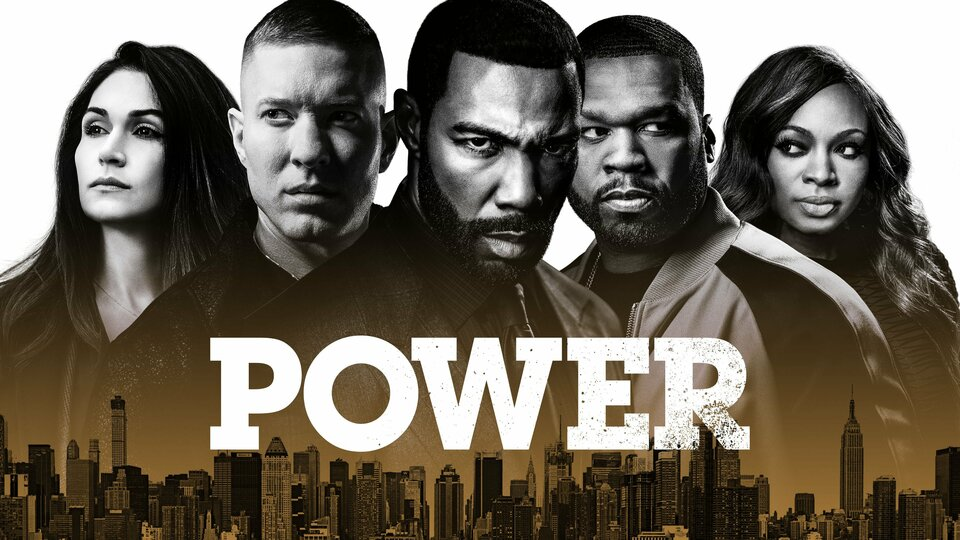

Una de las cosas que me maravilla, y a la vez no me sorprende para nada, es lo a menudo que podemos constatar la realidad que hay tras aquella famosa afirmación de "*tenemos mil canales y nada para ver*". ¿Quiénes están viendo todos esos productos? Quizá nadie los ve y todo es una gran estafa piramidal, pero de vez en cuando encuentras algo nuevo de lo que parece que nadie ha hablado antes.

En este caso, además, parece que tiene sentido que en el internet hispanohablante no se haya apenas mencionado el conglomerado de series de las que quería yo hablar hoy, dado que es un producto muy orientado a un tipo de espectador norteamericano concreto, del que aquí poco hay. Al grano:

Saltando de enlace en enlace, buscando no sé muy bien el qué, acabé en [imdb](https://www.imdb.com/) en alguna película en la que aparecía [**50 cent**](https://en.wikipedia.org/wiki/50_Cent), y se me ocurrió cotillear qué mas cine y tv había hecho. ¿Aparece en 44 capítulos de una serie que se llama [**Power**](https://en.wikipedia.org/wiki/Power_(TV_series))? ¿Qué carajo es eso? ¿También como productor ejecutivo? ¿Y sale en tantos capítulos sin ser el protagonista?

Seis temporadas emitidas en **Starz** entre 2014 y 2020, contando la historia de *Ghost*, traficante de drogas que está ascendiendo en la escalera del crimen de Nueva York, propietario de una sala de música, y toda la *troupe* que hay a su alrededor: amigos de la infancia, familia, ex-parejas... y los líos con la ley y con sus competidores en el mundo del crimen.

*Muy cliffhanger y mucho cliffhanger*, y me tragué las seis temporadas en un visto y no visto. Pero no te pares ahí, que esto ya tiene TRES series *spin-off*, en lo que se conoce como el *Power Universe*:

- [**Power Book II: Ghost**](https://en.wikipedia.org/wiki/Power_Book_II:_Ghost) -- La historia de *Tariq*, hijo del protagonista, posterior a la primera serie. Tres temporadas y ya renovada para una cuarta.
- [**Power Book III: Raising Kanan**](https://en.wikipedia.org/wiki/Power_Book_III:_Raising_Kanan) -- El origen de *Kanan*, el personaje de *50 Cent*, durante los años 90. Otras tres temporadas y de nuevo renovada para una cuarta.
- [**Power Book IV: Force**](https://en.wikipedia.org/wiki/Power_Book_IV:_Force) -- Secuela de la serie original, contando la historia de *Tommy Egan*, el socio y mejor amigo de *Ghost*. Dos temporadas y ya renovada para una tercera.

¿Pero qué está pasando aquí? ¿Cómo es posible que estemos hablando de ya catorce temporadas completas contando los tres *spin-offs*, con los tres renovados para continuar? ¿y qué aquí ni se haya mencionado?

Supongo que con un porcentaje muy significativo de la serie centrado en personajes afroamericanos, nadie ha pensado que aquí pudiera interesar, pero tiene la suficiente variedad de personajes como para verse perfectamente como una serie americana más.

No me he atrevido a entrar en los *spin-offs* porque no quería invertir la cantidad de horas que se me iban a ir por ese agujero, pero sigo considerándolo de cuando en cuando.

Cosas veredes, amigo Sancho.
