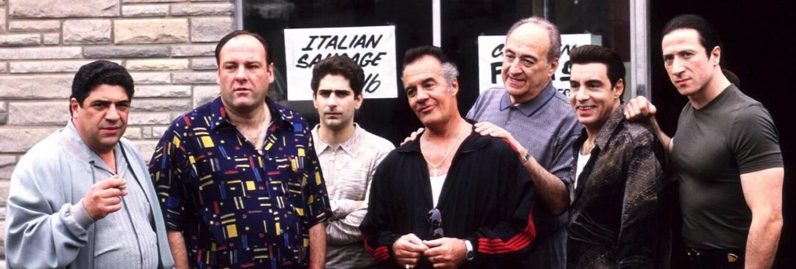
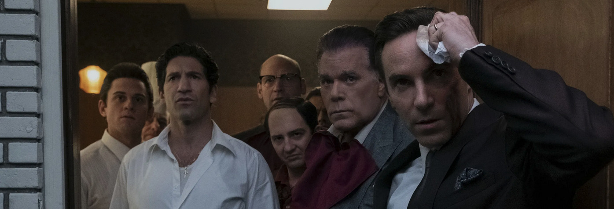
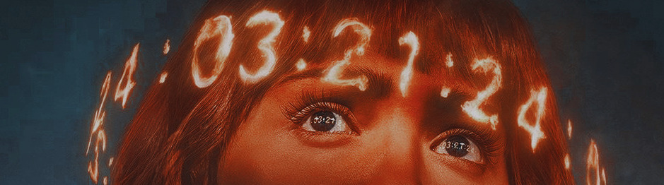

### [Los Soprano](https://thetvdb.com/series/the-sopranos) (*HBO*, 1999, 6 temporadas)

Pues otra vez he vuelto a ver **Los Soprano**. Qué os voy a contar yo a estas alturas que no hayan contado otros más y mejor en mil sitios distintos. En España representó el desembarco de una nueva forma de hacer televisión en un ahora antiguo Canal+ de pago que podíamos disfrutar en mi casa y, supongo que por eso, para mí representa un hito audiovisual, por llegar en el momento y en la edad en la que podía empezar a disfrutar de este tipo de productos. Otras series excepcionales, más o menos coetáneas, como [The Wire](https://thetvdb.com/series/the-wire), las he visto mucho más adelante pero no han podido dejar ese poso imborrable que tienen las cosas que llegan en el momento justo.

Esta panda de tarados mentales y sociópatas violentos y peligrosos se mueven durante toda la serie en la fina línea que separa el *personaje-del-que-quiero-saber-más* del villano impenitente. Bordean continuamente el *¿pero qué le pasa en la cabeza a este tipo?* y, sin embargo, no puedes evitar empatizar en ocasiones.

Y es aquí donde viene el principal cambio en las distintas veces que he visto Los Soprano: recuerdo de joven prestar más atención a la historia de *Christopher Moltisanti* (el sobrino joven... los finales de *Christopher* y *Adriana* siguen siendo momentos históricos de la historia de la televisión, que se te agarran al alma). Sin embargo, en este nuevo revisionado, ya en la cuarentena, son las propias situaciones familiares de *Tony Soprano*, el protagonista, las que me han mantenido pegado al televisor. Te pega en las entrañas de una forma completamente diferente.

Sinceramente, no sé si para alguien que no la haya visto puede representar lo mismo, aún siendo un hito indiscutible de la cultura popular moderna... ni lo sé ni me importa. Si compartes el sentimiento estoy contigo. Si no, hay más cosas ahí afuera para ver.

### [The Many Saints of Newark](https://letterboxd.com/film/the-many-saints-of-newark/) (2021)

Pues no te lo pierdas, que han hecho una película precuela de *Los Soprano* y yo sin haberme enterado. La incluyo aquí porque, además de no ser tampoco nada del otro mundo, es poco más que un episodio aparte contándonos la historia de *Dickie Moltisanti* (el padre de *Christopher* que se menciona en múltiples ocasiones en la serie original, en la que por razones obvias no aparece), durante los años 60 y 70.

Correcta, con algunos buenos actores en papeles clave y con el hijo de [*James Gandolfini*](https://www.imdb.com/name/nm0001254/) haciendo el papel del propio *Tony Soprano* de joven... aunque la película no va sobre él, no os dejéis engañar.

### [3 Body Problem](https://thetvdb.com/series/three-body-problem) (*Netflix*, 2024, 1 temporada por ahora)

Y si hablamos primero de un hito televisivo cuando las productoras todavía no sabían que se podían crear hitos televisivos, ahora pasamos a un intento de crear algo memorable que se queda en "*pues otra cosa de Netflix*".

Esto debería tenerlo todo para ser mi serie perfecta: ci-fi que debería ser *hard*, una investigación policiaca con un policía secreto, unos alienígenas y una teoría de la conspiración, un videojuego *online*, gente súper lista intentando resolver problemas súper complicados, una historia contada en distintos momentos del tiempo... y no. [Benioff](https://en.wikipedia.org/wiki/David_Benioff) y [Weiss](https://en.wikipedia.org/wiki/D._B._Weiss) (sí, los de *Juego de Tronos*) demuestran que no saben darle alma a nada, todo se queda en un producto manufacturado demasiado licuado, que pierde su capacidad para impresionar cuando tenía todas las papeletas para convertirse en el hito televisivo de la década.

Y sólo va a ser otra serie más de *Netflix*.

Preveo que cuando llegue la segunda temporada no voy a recordar ni un minuto de lo que he visto. ¿Recordáis [Rebel Moon](https://www.imdb.com/title/tt14998742/)? Pues eso.
