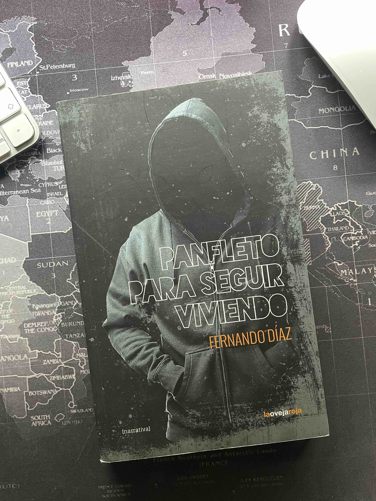

{.left width=50%}

**Panfleto para seguir viviendo**
Fernando Díaz (pseudónimo)
Editorial La Oveja Roja, 2014, 131 páginas

----

Pues mira, yo qué sé. No conozco al autor, aparentemente es un pseudónimo y en ningun lugar del ancho y largo internet he encontrado información acerca de quién es, o si ha escrito algo más, por más que lo he intentado. Pero es ya la tercera vez que me leo este libro, que de cuando en cuando me mira desde la estantería para intentar recordarme cosas.

En estos tiempos de lecturas de autoayuda, monólogos de autosuperación, terapia psicológica y omnipresentes pastillas de colores, a veces lo que hace falta es leer algo que te haga pensar que no estás sólo. Que no eres tú el raro, sino el sistema, que es una desgracia.

> *Creo que revolución no tendría que ser un nombre sino un verbo.* 
