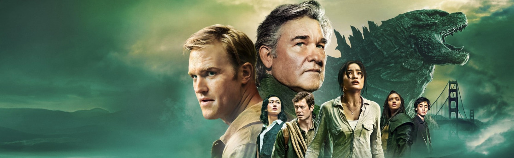
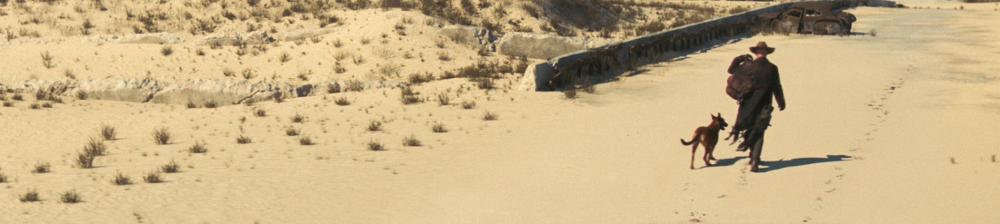
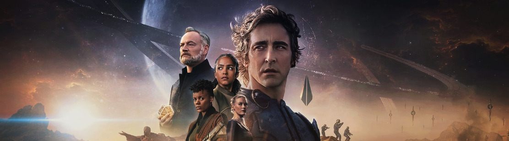

### [**Monarch: Legacy of Monsters**](https://thetvdb.com/series/godzilla-and-the-titans) (*Apple TV+*, 2023, 1 temporada)

Tengamos un momento de calma y sosiego, porque a esto le di un tiento casi sin querer, y he venido a descubrir que existe una cosa llamada el [MonsterVerse](https://en.wikipedia.org/wiki/MonsterVerse) que incluye ya cinco películas y dos series. 

**A favor**: esto se puede ver de forma completamente independiente, pero tiene suficientes detallitos para que te entren ganas de ver todas las películas relacionadas. Sale [Kurt Russell](https://www.imdb.com/name/nm0000621/). Sale Godzilla. Hay múltiples momentos temporales con los personajes de jóvenes y de viejos. Sale [Wyatt Russell](https://www.imdb.com/name/nm0751518/), hijo Kurt Russell y Goldie Hawn, y yo sin haberme enterado de esto tampoco (desconozco muchas cosas). Y muy conspiración y mucho conspiración.

**En contra**: los personajes estilo *chica-que-siempre-está-enfadada* que no añaden mucho a la trama además de estar siempre enfadada a mí cada vez me cargan más. A los japoneses les sale bien a veces en anime, el rollo [*tsundere*](https://en.wikipedia.org/wiki/Tsundere) tienen sus fans, pero no estoy entre ellos.

Si ignoramos esto último, que yo soy *especialito*, todo bien aquí.

### [Fallout](https://thetvdb.com/series/fallout) (*Amazon*, 2024, 1 temporada)

La norma no escrita de que cualquier adaptación de un videojuego a otro medio suele ser el *mierdolo* más absoluto últimamente se está resquebrajando. Ya me sorprendió [The Last of Us](https://thetvdb.com/series/the-last-of-us), y me ha sorprendido ahora **Fallout**. ¿Será porque cuando le metes dinero a algo y le das un poco de cariño, en lugar de simplemente intentar exprimir a los *fans*, el resultado es mejor? Quién lo iba a decir.

Todo muy bien aquí, la única pena es que el éxito de *Fallout* probablemente tape (aún más) la excelente [Silo](https://thetvdb.com/series/wool) que ya me dejó loco en su momento.

El mundo post-apocalíptico, con un retrofuturismo art decó y música de los años 50, está plasmado magistralmente en la serie y da un ambiente perfecto para las historias que nos quieren contar.

Qué pena que una serie con una crítica tan poco velada al *middle-management* y la cultura corporativa termine en un gran continuará sin cerrar una historia cohesionada, algo que es imposible no pensar fue decidido por un montón de señores encorbatados en una reunión de *márketing*. Seguiremos en la segunda temporada, qué le vamos a hacer.

*BTW*: todo internet está mencionado los papeles históricos de [Walton Goggins](https://www.imdb.com/name/nm0324658/), y a todo el mundo se le olvida *Venus Van Dam* en [Sons of Anarchy](https://www.imdb.com/title/tt1124373/). Actorazo, algún día le llegará el reconocimiento que merece.

### [Foundation](https://thetvdb.com/series/foundation-2021) (*Apple TV+*, 2021, 2 temporadas)

Voy por la segunda temporada, disfrutándola, pero mientras que las dos anteriores me atrevería a recomendarlas a cualquiera, con esta última tendría alguna reticencia. Creo que tiene sus detractores por tener diferencias con los libros originales (que aún no he leído, algún día) y fluctúa dependiendo de la escena entre "*uy, aquí han metido dinero*" y "*argh, vaya escenario de serie b*". Y aquí también hay otro personaje que podría ser bastante más interesante y tiene ratos de mismo rollo *tsundere* de "*mira que enfadada estoy*" que cansa.

Pero, verdad absoluta del universo:

*Todo lo que hace [Lee Pace](https://www.imdb.com/name/nm1195855/) mola*.{.center}

El argumento requiere algo más de compromiso por parte del espectador, porque los viajes estelares de años, los *cryosueños* de siglos, y la dinastía genética en la que el mismo actor hace de media docena de personas en el tiempo (idénticas, pero no la misma) pueden hacer que te pierdas si no prestas atención. Pero aquí hemos venido a prestar atención.

**Actualización**: he terminado de ver la segunda temporada, y en el par de capítulos finales hay una colección de *deus ex machina* tan flagrante que esto ha perdido muchos enteros como para andar recomendándolo. Parece que había ganas de bajar el nivel. Tendré que leer los libros.
