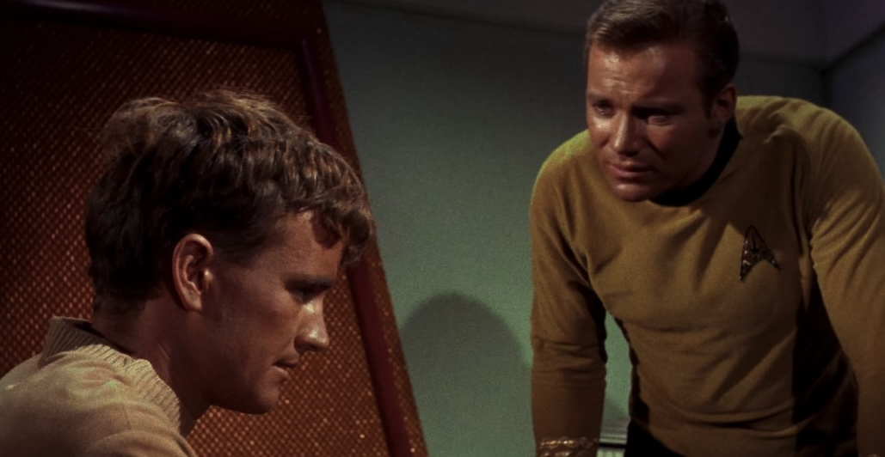

*Este post forma parte de una serie sobre el [revisionado completo de todo Star Trek](/tv/star-trek/), es recomendable empezar por ahí.*

Segundo episodio de la serie original, **Charlie X** (**s01e02**), emitido por primera vez el 15 de septiembre de 1966. La *Enterprise* recoge a un joven náufrago que ha crecido sin contacto humano, *Charlie Evans*, un adolescente de 17 años que no sabe cómo comportarse en sociedad.

Al principio, *Charlie* se esfuerza por entender las normas y comportamientos humanos. Se encariña con la asistente/ayudante de campo *Janice Rand* (el cargo es *yeoman*, que se traduciría al castellano como edecán, pero no estamos para estos tecnicismos), pero sus avances son inapropiados y no correspondidos.

Y qué lío aquí... algo que claramente no es del todo humano intentando aprender comportamientos humanos, a la vez que su parte humana llega a la adolescencia siendo varón, y tenemos al *Capitán Kirk* intentando explicar lo que está bien y no está bien en las relaciones sociales entre hombres y mujeres... en 1966. Podría haber envejecido exageradamente mal y haber sido algo muy turbio de ver a estas alturas, pero... sorprendentemente tampoco ha estado mal. *Star Trek* siempre fue muy avanzado a su época.

Como curiosidad, se puede intuir un principio de tonteo entre *Uhura* y *Spock* que nos dará para muchos debates futuros. Y el ajedrez 3D, que siempre mola.
