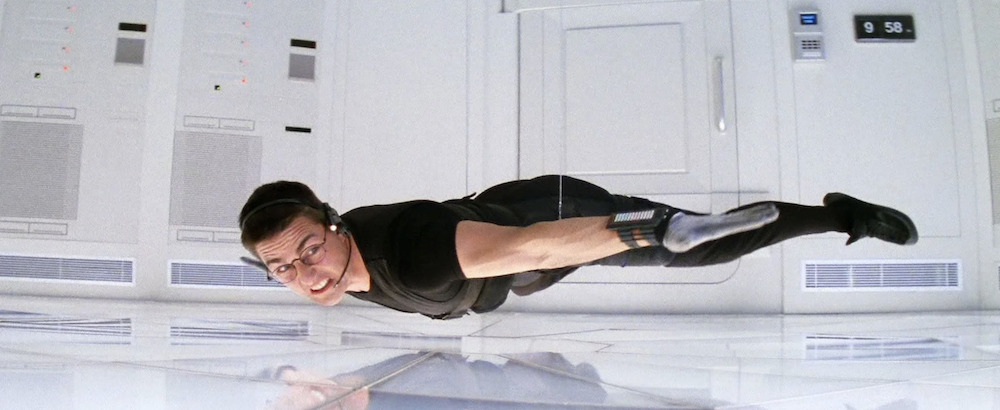

*Este post forma parte de [una serie de entradas sobre Mission: Impossible](/cine/misiones-imposibles/), es recomendable empezar por ahí.*

Montaña rusa de adrenalina que viaja en el tiempo desde 1996 hasta el salón de tu casa para recordarte que ya no se hacen películas como las de antes.

Tenía yo miedo de sufrir una *retrorotura* al refrescar esta primera aparición de un [Tom Cruise](https://www.imdb.com/name/nm0000129/) aún con aspecto casi juvenil después de varios lustros desde la última vez que la vi... pero no. Esto aguanta el tipo de los tiempos modernos casi en su totalidad y resulta agradecida de ver.

¿Qué podíamos esperar en su momento? El meme del "*focus*" que tanto ha repetido *Dwayne Johnson* queda en nada frente a la capacidad de Tom Cruise de sacar proyectos adelante y tener una visión clara de lo que quiere hacer. Un protagonista que ya estaba en lo más alto de Hollywood (ya venía de hacer cosas como [Entrevista con el Vampiro](https://www.imdb.com/title/tt0110148/), [Algunos hombres buenos](https://www.imdb.com/title/tt0104257/), [Nacido el 4 de Julio](https://www.imdb.com/title/tt0096969/) o [Rain Man](https://www.imdb.com/title/tt0095953/)). Un director, [Brian de Palma](https://www.imdb.com/name/nm0000361/), que habiendo firmado películas como [Carrie](https://www.imdb.com/title/tt0074285/), [Scarface](https://www.imdb.com/title/tt0086250/) o [Los Intocables](https://www.imdb.com/title/tt0094226/) de repente le da por intentar un *blockbuster* de acción. Dos guionistas que venían de *Jurassic Park* y *La Lista de Schindler*.

Si es que no podía salir mal. Y no salió mal.

La película se presenta como una fiesta del engaño, donde nada es lo que parece y todo puede cambiar en un abrir y cerrar de ojos. Desde la inolvidable escena inicial en Praga, con su combinación de tensión y traición, queda claro que Brian De Palma vino a jugar. Es una lección de cómo construir suspense con pequeños detalles, silencios inquietantes, y la música de [Danny Elfman](https://en.wikipedia.org/wiki/Danny_Elfman) que le da ese toque casi operístico y el [tema original](https://en.wikipedia.org/wiki/Theme_from_Mission:_Impossible) de [Lalo Schifrin](https://en.wikipedia.org/wiki/Lalo_Schifrin) versionado para la ocasión por [Adam Clayton](https://en.wikipedia.org/wiki/Adam_Clayton) y [Larry Mullen Jr.](https://en.wikipedia.org/wiki/Larry_Mullen_Jr.) (los "menos famosos" de U2) proporcionando el toque de magia nostálgica.  

Por supuesto, si hay una secuencia que se ha incrustado en la memoria colectiva, es la del robo en el cuartel general de la CIA. Ethan Hunt colgando de un cable, sudando la gota gorda, en una coreografía de precisión que demuestra que, a veces, menos es más. Nada de explosiones exageradas ni persecuciones interminables; solo tensión pura y un silencio ensordecedor que te hace aguantar la respiración.  

Y luego está el final en el tren bala, que para la época era una oda al exceso pero que ahora se siente deliciosamente retro, con el cine de acción ya eclipsado en tiempos post Michael Bay. Los efectos especiales pueden haber envejecido un poco (no mucho), pero la energía de la escena, con helicópteros dentro de túneles y Cruise aferrándose al techo como un gato callejero, sigue siendo magnética. Un recordatorio de lo que puede suceder cuando una película está dirigida con estilo, interpretada con carisma y no tiene miedo de ser un poquito extravagante.  
