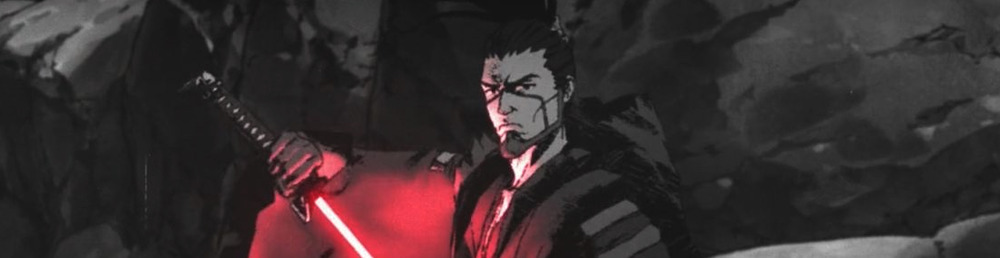
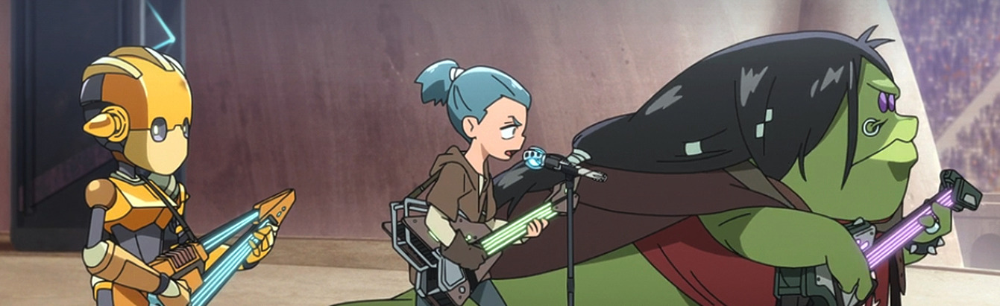
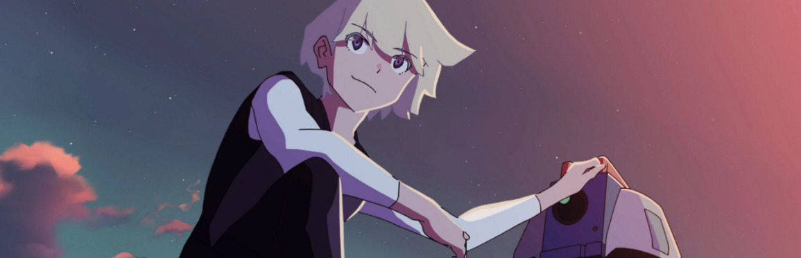

*Este post forma parte de una serie sobre [todo Star Wars](/cine/todo-star-wars/), es recomendable empezar por ahí.*

La primera temporada de "[**Star Wars: Visions**](https://en.wikipedia.org/wiki/Star_Wars:_Visions)" es una antología animada, compuesta por nueve cortometrajes, cada uno creado por diferentes estudios de [anime](https://en.wikipedia.org/wiki/Anime) japoneses. Cada episodio cuenta una historia independiente con personajes y tramas originales, ofreciendo una reinterpretación que fusiona la estética y la narrativa del anime con el universo de Star Wars. 

## Episodio 1: The Duel

El primer episodio de "Star Wars: Visions" se titula "The Duel" y está producido por el estudio **Kamikaze Douga**. Este episodio reinterpreta del universo de Star Wars con el estilo visual del cine samurái. Mira que la animación no es nada del otro mundo, unas *tres-dé* sencillas, pero con una dirección de arte principalmente en blanco y negro que le da un empaque mucho mayor de lo que tendría de otro modo.

"The Duel" sigue la historia de un misterioso ronin que llega a un pequeño pueblo, justo antes de ser atacado por un grupo de bandidos liderados por una Sith con un sable de luz que nos deja *lóquer*... [se le acopla un "adaptador"](https://starwars.fandom.com/wiki/Lightsaber_parasol) que refleja o divide la hoja como si fuera el esqueleto de un paraguas.

Muy samurái y mucho samurái. Empieza muy *top* la antología.

## Episodio 2: Tatooine Rhapsody

Producido por el estudio [**Studio Colorido**](https://en.wikipedia.org/wiki/Studio_Colorido), nos cuenta la historia de Jay, un joven padawan que se convierte en el vocalista de una banda de rock llamada Star Waver. Sí, rock en Star Wars.

Durante un concierto el bajista, un joven Hutt llamado Geezer, es capturado por un Boba Fett muy [*kawaii*](https://en.wikipedia.org/wiki/Kawaii), trabajando a las órdenes de Jabba el Hutt. Y *bla bla*, el poder de la amistad y la música y un concierto en el circuito *de vainas* de Mos Espa.

Me ha dado una impresión muy de "anime tradicional": si quitamos las referencias a Star Wars y nos imaginamos unos chavales montando un grupo de música y metiéndose en líos con unos yakuza, tenemos una serie montada de varias temporadas.

## Episodio 3: The Twins

Wow. El estudio [**Trigger**](https://en.wikipedia.org/wiki/Studio_Trigger) se vino arriba con esto. Un estilo muy [Kill la kill](https://en.wikipedia.org/wiki/Kill_la_Kill) (obviamente de los mismos creadores) con una animación visualmente espectacular.

"The Twins" cuenta la historia de Karre y Am, dos gemelos creados por el lado oscuro y entrenados para utilizar una súper arma que puede destruir planetas (novedad). Uno de los hermanos empieza a cuestionarse las cosas y ya todo el episodio es una pelea espectacular entre ambos gemelos.

No tiene sentido alguno, la gente por el espacio respirando y hablando como si no pasara nada, y un final  con una variación de la [maniobra Holdo](https://starwars.fandom.com/wiki/Holdo_maneuver) que tanto me hizo tirarme de los pelos con Episodio VIII. Pero es divertido.
