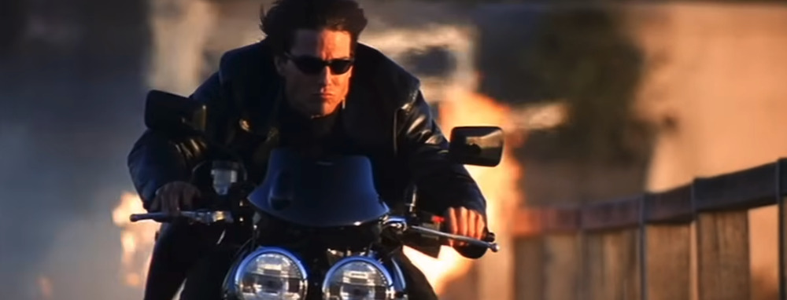

*Este post forma parte de [una serie de entradas sobre Mission: Impossible](/cine/misiones-imposibles/), es recomendable empezar por ahí.*

Dejamos la precisión de Brian De Palma para aterrizar directamente en una locura de motocicletas voladoras, explosiones a cámara lenta y palomas blancas en pleno vuelo. *[Mission: Impossible 2](https://www.imdb.com/title/tt0120755/)* es la secuela en la que [Tom Cruise](https://www.imdb.com/name/nm0000129/) decidió que la sutileza era opcional y que lo suyo iba a ser un desfile de testosterona estilizada. ¿El responsable? [John Woo](https://www.imdb.com/name/nm0000247/), maestro del cine de acción de Hong Kong, que trajo consigo su arsenal de movimientos en cámara lenta, tiroteos coreografiados y simbolismos visuales.  

¿El resultado? Pues a ver, qué te voy a decir yo que no sepas tú ya. Una película absurda. Puede ser divertida, siempre que vayas preparado para dejar la lógica en la puerta. Y estoy seguro de que en el año 2000 esto tuvo otras interpretaciones, cuando Internet todavía no estaba tan extendido como lo está hoy en día, y los fans del cine de Hong Kong venían de etapas previas intercambiando cintas VHS. Estoy seguro de que hay quien la defiende, y sus virtudes tendrá, pero no era su público en su momento y sigo sin serlo.

*Ethan Hunt* pasa de ser un espía con cara de póker a un héroe romántico a la vez que guerrero acrobático. ¿La misión? Evitar que un virus letal llamado *Chimera* caiga en manos equivocadas, la excusa para ver a *Cruise* haciendo cabriolas escalando montañas, esquivando balas mientras hace piruetas, y teniendo un duelo final en motocicletas que desafía todas las leyes de la física y del sentido común.

No quiero entrar mucho en el folleto turístico mal entendido acerca de las fiestas tradicionales españolas, donde mezclan la Semana Santa con las fallas en un pueblo que parece más México que Sevilla.

> Honrar a los Santos quemando cosas. Curiosa manera de venerarlos, ¿no cree? Por poco me queman al venir hacia aquí.
>
> Anthony Hopkins en Mission: Impossible 2

Que no es que a mí me importe mucho esto, pero vaya, que son dos minutos de documentacion para no meter la pata. Y más para hacerle a *Anthony Hopkins* soltar estas frases (no aparece ni en los créditos pese a tener varios minutos en la película). Hollywood a veces tiene una visión muy peculiar del mundo.  

En cualquier caso, esta *Mission: Impossible 2* nos queda como el hijo rebelde de la saga: imperfecto, exagerado, pero lleno de momentos de entretenimiento noventero dando sus últimos estertores ante el cambio de siglo. Pero si hablamos de algo noventero, recordemos que la película empieza con esta banda sonora. Y eso no nos lo puede quitar nadie.



