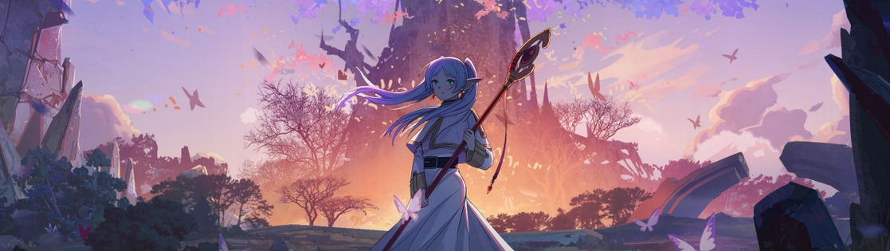
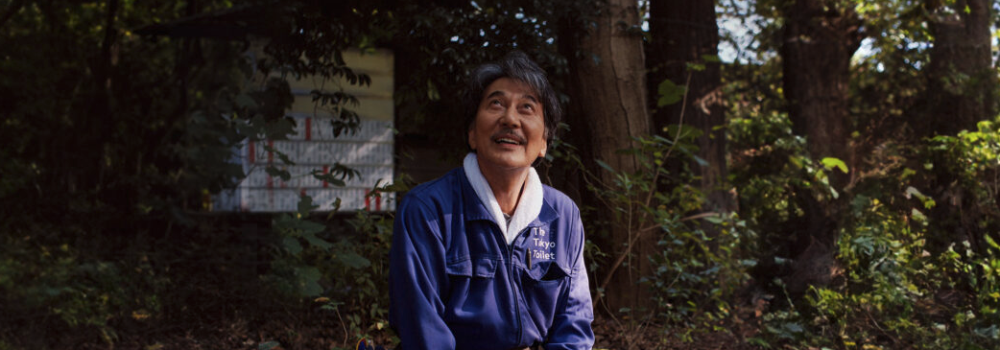

## Frieren

葬送のフリーレン, *Sōsō no Furīren*

Y ya está. Con esto podría terminar la lista de lo mejor del 2024. Ya mencioné la serie [cuando empecé a verla](/anime-de-otono-desigual/) en noviembre del 23: manga con 22 millones de tomos vendidos, premio [Manga Taishō](https://en.wikipedia.org/wiki/Manga_Taish%C5%8D) 2021, mejor nuevo creador 2021 en el [Tezuka Osamu Bunkashō](https://en.wikipedia.org/wiki/Tezuka_Osamu_Cultural_Prize), [Shogakukan Manga](https://en.wikipedia.org/wiki/Shogakukan_Manga_Award) 2023 y [Kodansha Manga](https://en.wikipedia.org/wiki/Kodansha_Manga_Award) Shōnen 2024, y espectacular serie de [Madhouse](https://en.wikipedia.org/wiki/Madhouse,_Inc.) de 28 episodios a la espera del estreno de la segunda temporada.

Si sólo vas a ver algo de este año, que sea [Frieren](https://en.wikipedia.org/wiki/Frieren).

**Menciones honoríficas**: [Solo Leveling](https://en.wikipedia.org/wiki/Solo_Leveling) me ha sorprendido gratamente. [Yamada-kun](https://en.wikipedia.org/wiki/My_Love_Story_with_Yamada-kun_at_Lv999) (*Yamada-kun to Lv999 no Koi wo Suru* o *Mi historia de amor con Yamada-kun a nivel 999*) ha sido muy divertida. Mucha gente menciona [Fallout](https://en.wikipedia.org/wiki/Fallout_(American_TV_series)) como algo que hay que ver, pero para mí [Silo](https://en.wikipedia.org/wiki/Silo_(TV_series)) estuvo muy por encima un año antes. Y no he visto aún [Shogun](https://en.wikipedia.org/wiki/Sh%C5%8Dgun_(2024_TV_series)), que probablemente sea de lo mejor del año en televisión, pero está por comprobar. [Tokyo Vice](https://en.wikipedia.org/wiki/Tokyo_Vice_(TV_series)) terminó este año 2024 tras dos temporadas inmensas en las que no he visto a nadie hablar de la serie... y aunque termina más o menos cerrada podría haber continuado pero decidieron cancelarla. Malos tiempos para la *prestige tv*.

## Perfect Days

[Win Wenders](https://www.imdb.com/name/nm0000694/) me pilló con la guardia baja y en un año en el que certifico con mi sello de calidad particular la muerte del cine como medio de masas, es [la mejor película](https://www.imdb.com/title/tt27503384/) que podemos salvar de la produccion anual. No era nada de lo que me esperaba y fue mucho mejor de lo que podía prever.

Hay cosas que tengo pendientes que quizá merezcan la pena: [The Brutalist](https://www.imdb.com/title/tt8999762/), [A Real Pain](https://www.imdb.com/title/tt21823606/)... pero en general he visto pocas cosas que salvar. Y, bueno, que todo es "parte 2" y eso me ha dado mucha pereza: [Dune](https://www.imdb.com/title/tt15239678/), [Gladiator](https://www.imdb.com/title/tt9218128/), [Furiosa](https://www.imdb.com/title/tt12037194/), [Inside Out](https://www.imdb.com/title/tt22022452/), [Joker](https://www.imdb.com/title/tt11315808/)... cuando no es ya la parte diecinueve, y ni aún así, yendo supuestamente a tiro hecho, salen producciones aceptables. La confianza en las *majors* ha desaparecido y ya no apetece mucho ir al cine.

De [Deadpool y Lobezno](https://www.imdb.com/title/tt6263850/) no puedo decir nada, porque ya sé que es una cosa para pajerillos autoreferenciales, pero para sorpresa de nadie me lo pasé teta.
