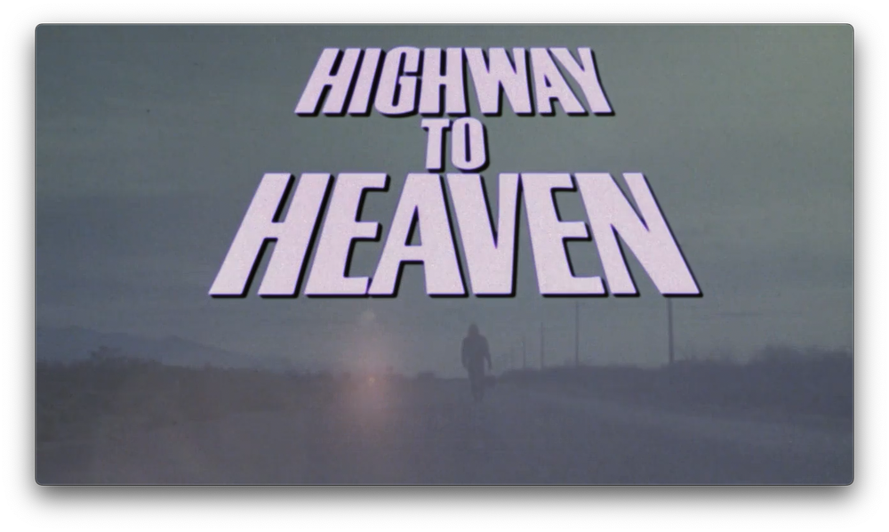

Han pasado 40 años desde que *[Highway to Heaven](https://es.wikipedia.org/wiki/Highway_to_Heaven)* (*Autopista hacia el cielo* en España) llegó a la televisión y a día de hoy se puede ver como una cápsula del tiempo de lo que solía ser el entretenimiento: un poco más inocente, un poco más lento, pero lleno de corazón. Esta serie no tenía miedo de llevarte de la risa al drama en un momento, todo envuelto en esa calidez ochentera que hoy parece casi ingenua.

Un ángel enviado a la tierra para ayudar a la gente que lo necesita, que va de pueblo en pueblo y de episodio en episodio solucionando desdichas a diestro y siniestro. Siempre con amabilidad. ¿Qué más se puede pedir?

Creada, escrita, protagonizada y dirigida en muchas ocasiones por [Michael Landon](https://en.wikipedia.org/wiki/Michael_Landon), esta serie fue su último gran proyecto televisivo. Y hablar de él es hablar de una de las caras más icónicas de la televisión estadounidense del siglo XX. Antes de convertirse en el ángel de *Highway to Heaven*, Landon ya era una leyenda gracias a sus papeles como Little Joe en *[Bonanza](https://en.wikipedia.org/wiki/Bonanza)* y Charles Ingalls en *[La casa de la pradera](https://en.wikipedia.org/wiki/Little_House_on_the_Prairie_(TV_series))*, y ambas series son palabras mayores. Con su pelazo perfecto y una sonrisa que parecía esconder siempre un secreto amable, tenía un talento especial para interpretar personajes llenos de humanidad. 

Y todo esto está muy bien, diréis, pero ¿qué carajo hace uno viendo esta serie de 1984 en plena era de algoritmos de plataformas de *streaming*? Pues hablaba no hace tanto acerca de [The Big Door Prize y las *cozy series*](/movidas-catodicas-ciencia-ficcion-televisiva/), y no he hablado de *[Ted Lasso](https://en.wikipedia.org/wiki/Ted_Lasso)* aunque seguramente debiera haberlo hecho... pero es que últimamente me cuesta encontrar entretenimiento que no esté continuamente bombardeando el cerebro subiendo los niveles de cortisol o proporcionado interminables dosis de dopamina. Y de eso últimamente hay poco. A lo mejor por eso triunfan las películas de [Dani Rovira](https://en.wikipedia.org/wiki/Dani_Rovira), que son una desgracia pero es que pocas cosas hay que intenten ser amables con el espectador. Así que en esas estoy. O tragarme esa desgracia de películas o buscar *cozy series* en el pasado televisivo. He optado por esta segunda opción.

Bueno y que soy un *cheñor* mayor que ya chochea y piensa que de 1999 para acá pocas cosas se salvan. Así que me acabo de ver los dos primeros episodios, que son la primera historia, y de aquí hacia adelante.
