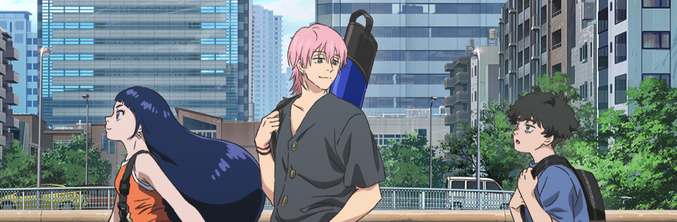
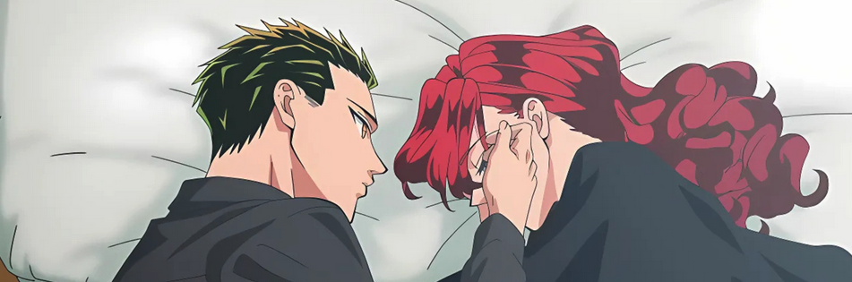

Parece mentira, pero no he publicado más *posts* sobre [anime](/tags/anime/) precisamente desde finales del año anterior, en una misma entrada acerca del [Anime de otoño de 2023](/anime-de-otono-desigual/). Algunas cosas a las que le he dado un tiento a finales del año pasado:

## Sakamoto Days

[[wikipedia](https://en.wikipedia.org/wiki/Sakamoto_Days)]

Un asesino despiadado e infalible se ha retirado del oficio y ahora trabaja como tendero en un [*konbini*](https://en.wikipedia.org/wiki/Convenience_store#Japan) y padre de familia. *Not my cup of tea*. Ni la animación, ni el diseño de personajes ni lo que me cuentan me ha llamado más allá del primer episodio. *Next*.

## Negative Positive Angler

*NegaPosi Angler*, ネガポジアングラー, *Negapoji Angurā*. [[wikipedia](https://en.wikipedia.org/wiki/Negative_Positive_Angler)]

Un estudiante universitario que está pasando por un (profundo) bache en la vida conoce a un grupo de aficionados a la pesca y le da por ahí. ¿Qué hago yo viendo esto si a mi la pesca *ni fu ni fa*? Mucha gente la ha comparado (y yo lo voy a hacer también) con [Welcome to the N.H.K.](https://en.wikipedia.org/wiki/Welcome_to_the_N.H.K.), por navegar también constantemente entre las dos aguas de la comedia y el dramón vital de un deshecho humano que no parece capaz de enderezar su existencia.

*NHK* me dejó un poso que he ido madurando durante los últimos meses; preferí no escribir nada al terminarla porque creo que estas cosas hay que observarlas desde una cierta perspectiva. Está aún pendiente, todo llegará. *NegaPosi Angler* sin embargo tras tres capítulos no se me está acercando a la calidad de la otra, pero sigue teniendo un cierto interés así que quizá la continúe.

## Yakuza Fiancé

*Raise wa Tanin ga Ii, 来世は他人がいい* [[wikipedia](https://en.wikipedia.org/wiki/Yakuza_Fianc%C3%A9)]

Dos clanes yakuza apalabran el matrimonio de dos jóvenes con graves taras emocionales. A estas alturas de la vida debería escribir algo como "*yo es que la romantización de la toxicidad en las relaciones no la quiero ya ni en el anime*", pero... en fin. Cosas veredes, amigo Sancho. Podría ser que la estuviera viendo. Esto es muy *heavy*.
