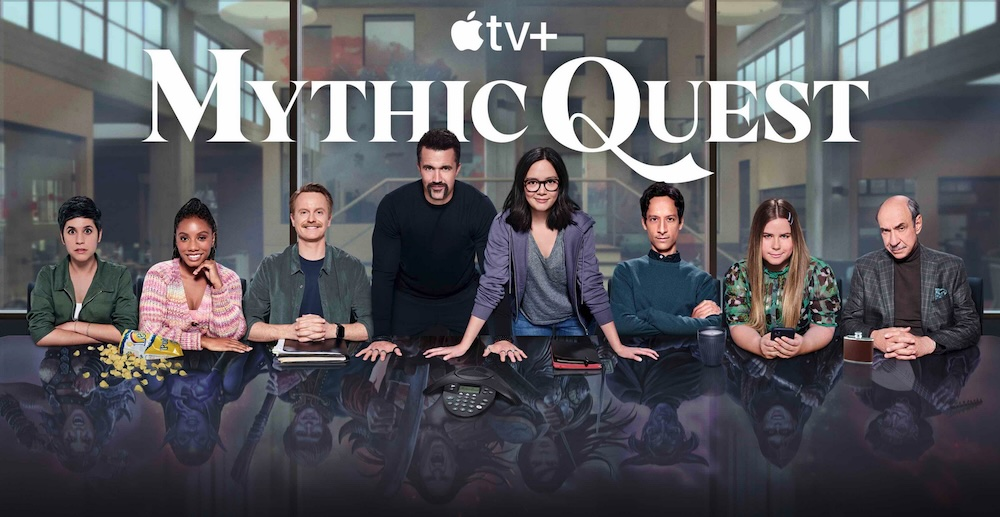
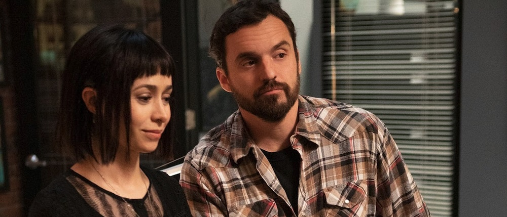

En el episodio de hoy de "*Cosas que nadie más parece estar viendo*", [*Mythic Quest*](https://en.wikipedia.org/wiki/Mythic_Quest), que es una tontería de serie como la copa de un pino pero ahi me trago sus temporadas cada año.

Para entender de dónde sale esto y por qué aquí no lo ve nadie (además de que sea de Apple TV, que no parece tener muchos suscriptores en España, o sí, qué sabré yo), hay que entender que viene creada y avalada por varios de los integrantes de [*It's Always Sunny in Philadelphia*](https://en.wikipedia.org/wiki/It%27s_Always_Sunny_in_Philadelphia), la *sitcom* más longeva de la historia televisiva (americana, claro, sin contar series de animación). 

Iba a escribir que nunca ha sido emitida en castellano, pero lo bueno que tiene internet es que puedes buscar y los resultados te callan el boquino rápido... con el desastroso título de "*Colgados en Filadelfia*" (virgen santa), está en Disney+ (que es dueña de Fox, que es dueña de FX, que emite la serie, o algo así). Estaba convencidísimo de que esto no había llegado hasta aquí, porque creo que jamás he oído a nadie que conozca ninguna referencia o mención a la serie, salvo que la vieran en su versión original. Cosas veredes, amigo Sancho.

A lo que iba es que en estas tierras no sueles leer referencias ni a una cosa ni a la otra. Aunque no tengan que ver (por supuesto no es un *spin-off*), sino que simplemente algunos integrantes producen la nueva serie y comparte algún actor, pasa bajo el radar. Plataforma minoritaria. Y para más delito, trata sobre un estudio de videojuegos que produce un juego [*MMORPG*](https://en.wikipedia.org/wiki/Massively_multiplayer_online_role-playing_game) (con sus programadores y artistas y productores y *testers* y demás mandangas). Receta para ser serie de nicho dentro de nicho.

La verdad es que tampoco puedo sacar a relucir muchas virtudes como para recomendarle a nadie que la viese... es una de esas series que soy plenamente consciente de que me gustan porque soy su público objetivo obvio, pero no hay muchas razones para ensalzarla. Las historias son normales, las actuaciones del montón y poca cosa especial puedes encontrar, aunque de vez en cuando algún detalle de algún episodio es realmente brillante. En cada temporada, eso sí, uno de los capítulos es completa y absolutamente independiente, en personajes, actores, situaciones y a veces incluso en el momento histórico en el que están ambientados; y en ese episodio independiente, la serie siempre ha brillado como una supernova. Magníficos. La cuarta temporada no ha tenido un episodio suelto, sino un mini *spin-off* completo de cuatro capítulos (que aun estoy viendo) con el título de [*Side Quest*](https://en.wikipedia.org/wiki/Side_Quest_(TV_series)). Mención especial también para un único capítulo creado durante el infame año de la pandemia, rodado entero con cada actor en su casa en videollamadas. *Magic*. Lo mejor han sido estos capítulos, con diferencia. 

Detrás de la serie, como productores, está también la megaproductora (e imperio del mal) [UbiSoft](https://en.wikipedia.org/wiki/Ubisoft), que entre otras cosas proporciona unas *cutscenes* videojueguiles que embellecen los cortes de la serie. En su momento se estrenó en Netflix [un documental](https://www.imdb.com/title/tt7655524/) sobre el desarrollo de uno de sus juegos ([*For Honor*](https://en.wikipedia.org/wiki/For_Honor)) centrado en las personalidades que lo estaban haciendo... que no dejaba muy bien a nadie. Y me fue imposible no ver paralelismos muy claros entre las personas reales y los personajes de la serie que, sobre todo en su primera temporada, no parecían estar interesados en transmitir mensajes positivos acerca de nadie. Hay espacio para salseo aquí, pero tengo poco interés en buscar más información, si os digo la verdad. Queda como ejercicio para casa.

Y hasta aquí. La puedo recomendar: no. La quiero recomendar: sí. La disfruto: mucho.

