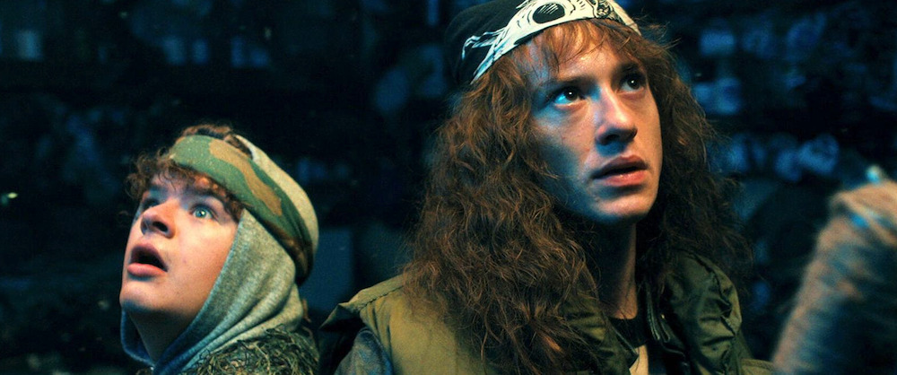
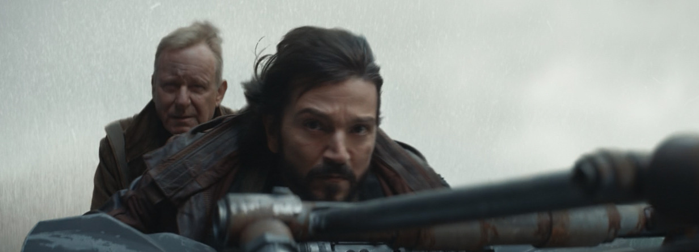

## Stranger Things

No podemos tener cosas bonitas, porque de todo nos vamos a quejar. Y yo aquí ya me rindo, me bajo del carro de *haterismo*, porque de [Stranger Things](https://en.wikipedia.org/wiki/Stranger_Things) me gusta todo. Ha sido divertida, ha sido emocionante, ha tenido personajes que desarrollar y ha tenido la dosis justa de misterios para que el publico *mainstream* no se quemara demasiado. 

Pero que una serie con partidas de [Dungeons & Dragons](https://en.wikipedia.org/wiki/Dungeons_%26_Dragons), viajes extraplanares, agujeros de gusano, poderes mentales y niños de primaria haya conseguido marcar el [zeitgeist](https://en.wikipedia.org/wiki/Zeitgeist) televisivo tiene un meritazo que ya podéis decir misa. En esta colina moriré. *Hellfire Lives!*

## Superman

Pues otro tanto de lo mismo. Quizá haya sido 2025 (por fin) el año de olvidarnos un poco de la tristeza y el drama impostados, de los hombres murciélago de cielos marrones, y haya sido el año de pensar que podemos ir al cine a ver una película que es divertida, que acaba bien, y salir de la sala queriendo ser un poquito mejor persona. Y tenía yo cero esperanzas en ninguna producción que saliera ya con el sello de DC desde hace muchos años. Gracias [James Gunn](https://en.wikipedia.org/wiki/James_Gunn). Gracias [Superman](https://en.wikipedia.org/wiki/Superman_(2025_film)).

Y no se puede escoger mejor [una canción](https://www.youtube.com/watch?v=8P09rxVaQAM) para una película.

## Andor

Bueno, y qué le vamos a hacer, triplete de frikismo para las cosas que más me han gustado de este pasado 2025. Pero es que [Andor](https://en.wikipedia.org/wiki/Andor)... Andor es lo que los fans de [Star Wars](https://en.wikipedia.org/wiki/Star_Wars) necesitábamos. Siendo una serie, Andor es la mejor película de Star Wars en décadas. Sin sables láser. Sin Jedis.

No me atreví a escribir por aquí sobre la serie cuando vi su primera temporada, porque quizá en el momento en que comenzaba un genocidio en nuestro *Mundo Real&trade;* se me hacía complicado hablar sobre el argumento: cómo nace una célula terrorista para intentar derrocar a un gobierno totalitario. Y hasta aquí puedo leer sin espantar a los potenciales lectores, y sin que se descuelguen varias personas por la ventana al grito de *[FBI, open up!](https://www.youtube.com/watch?v=wf9k3heENYc)*

En mi nueva oficialidad, el canon oficial para comenzar a ver Star Wars ahora es: **Andor + Rogue One + A new hope**.
