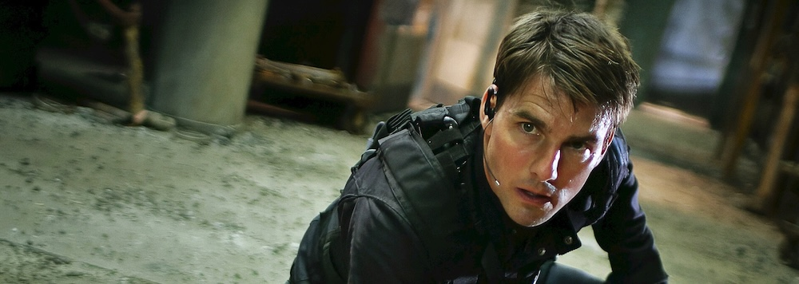

*Este post forma parte de [una serie de entradas sobre Mission: Impossible](/cine/misiones-imposibles/), es recomendable empezar por ahí.*

Después del subidón estilizado de [John Woo](https://www.imdb.com/name/nm0000247/) y sus palomas, la saga aterriza en 2006 con la sensación de que alguien ha pulsado el botón de reset sin avisar. *[Mission: Impossible III](https://www.imdb.com/title/tt0317919/)* es la entrega genérica por excelencia, la que parece hecha por encargo para enseñar un *demo reel* de televisión premium aplicado al cine de acción. ¿El responsable? [J.J. Abrams](https://www.imdb.com/name/nm0009190/) debutando en cine después de haberse hecho un nombre con [Alias](https://www.imdb.com/title/tt0285333/) y [Lost](https://www.imdb.com/title/tt0411008/).

La película arranca con un *Ethan Hunt* retirado y a punto de casarse. ¿Retirado de qué exactamente? ¿Cuándo pasó eso? ¿Por qué? Nadie nos lo cuenta. Venimos de verle hacer cabriolas imposibles en motocicleta en la anterior y de repente está en una fiesta de compromiso brindando con cuñados. No es que esté mal la idea de un *Hunt* intentando llevar una vida normal, es que la película da por hecho que ya conocemos a este personaje cuando en realidad lo está reinventando sobre la marcha sin molestarse en presentárnoslo. Falta una capa entera de contexto.

Y luego está *Julia*. La prometida. Interpretada por [Michelle Monaghan](https://www.imdb.com/name/nm1157358/), que hace lo que puede con lo que le dan, que no es mucho. Es un personaje insípido construido a partir de una sola función narrativa: ser el motivo emocional por el que *Ethan* tiene algo que perder. Sin personalidad propia, existe para sonreír y para estar en peligro. El cine de acción ha hecho esto mil veces y casi nunca sale bien, pero aquí duele especialmente porque la película apuesta toda su carga emocional a una relación que nunca llega a ser creíble.

> Who are you? What's your name? Do you have a wife? A girlfriend? Because if you do, I'm gonna find her. I'm gonna hurt her. I'm gonna make her bleed, and cry, and call out your name. And then I'm gonna find you, and kill you right in front of her.
>
> Philip Seymour Hoffman en Mission: Impossible III

Si esta película se sostiene es por [Philip Seymour Hoffman](https://www.imdb.com/name/nm0000450/). Su *Owen Davian* es probablemente el mejor villano de toda la saga, y no por aparatosidad: por todo lo contrario. Es un tipo aburrido, funcionarial, que mira a *Ethan Hunt* como quien mira a un molesto problema administrativo y le promete cosas terribles con el tono de quien está cerrando la oficina antes de irse a cenar. Cada vez que aparece en pantalla la película sube tres escalones.

Lo curioso es que J.J. Abrams sí trae cosas que se quedarán en la saga: el ritmo de equipo coral, [Simon Pegg](https://www.imdb.com/name/nm0670408/) como *Benji* apuntando maneras antes de convertirse en pilar, [Ving Rhames](https://www.imdb.com/name/nm0000609/) volviendo a tener algo que hacer, y un cierto gusto por el *spy movie* clásico que las siguientes entregas irían refinando. También está [Michael Giacchino](https://www.imdb.com/name/nm0315974/) firmando aquí su primera banda sonora para la saga, que se quedaría a partir de entonces. Como semilla de lo que vendría después no está mal. Como película independiente, es la más olvidable de las tres primeras: una entrega de transición que se ve sin demasiado entusiasmo y se olvida con una facilidad sospechosa. Salvada por un villano histórico y poco más.
