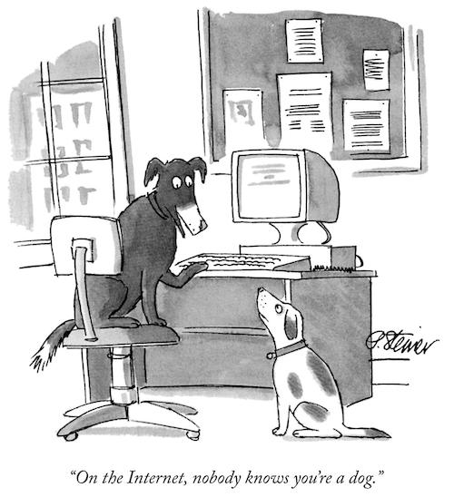

## ¿Qué es esto?

Esta es la página personal de Iván Alonso. Si nos conocemos quizá haya sido con el nombre de **Folken** ([muds](http://en.wikipedia.org/wiki/MUD) varios, [cYbErDaRk.NeT](http://www.cyberdark.net/index2.php)), **Ddraencara** ([XBox Live](https://live.xbox.com/es-ES/Profile?pp=0&GamerTag=ddraencara) o [World of Warcraft](http://eu.battle.net/wow/en/character/shendralar/Ddraencara/) por ejemplo) o, desde hace ya tiempo, **neverbot**, el _nick_ más habitual que utilizo.

## ¿De qué hablo aquí?

En principio de cualquier cosa que me cruce por la cabeza captando mi interés durante más de media hora, lo que viene siendo un *blog*, vaya. En la práctica suele ser sobre consumismo multimedia e internet en general, desde la perspectiva de lo mal que está el mundo la mayor parte de las veces, aunque estoy trabajando en practicar un punto de vista más positivo siempre que puedo.

Además del *blog* en sí (comentarios/*posts* en orden cronológico inverso), también hay unas cuantas páginas más estables donde suelo ir recopilando material publicado anteriormente, a modo de índices de categorías:

### Páginas

- [About/Acerca de...](/about/), la página que estás leyendo ahora mismo.
- **Libros**:
  - [Lista de los Premios Hugo de novela que voy leyendo](/los-premios-hugo/) (aunque esta iniciativa quedó parada apenas empezó).
  - La [categoría de libros](/tags/libros).
- **Televisión**:
  - [Índice general sobre temática de televisión](/tv/) en esta página.
  - [Movidas catódicas](/tags/movidas-catodicas/), categoría propia de *posts* con micro reseñas sobre series vistas.
  - [Revisionado completo de todo Star Trek](/tv/star-trek/).
  - La [categoría de televisión](/tags/tv).
- **Cine**:
  - [Índice general sobre temática de cine](/cine/) en esta página.
  - [Reseñas cinematográficas relámpago](/tags/resenas-cinematograficas-relampago/), categoría de *posts* con micro reseñas sobre películas vistas.
  - [Revisionado completo de todo Star Wars](/cine/todo-star-wars/).
  - La [categoría cine](/tags/cine).
- **Anime**:
  - [Índice general sobre temática de Anime](/anime/) en esta página.
  - Todo [Shingeki no Kyojin - Ataque a los Titanes](/anime/shingeki-no-kyojin/).
  - [Revisionado de Overlord](/anime/overlord/).
  - [Revisionado de Mushoku Tensei](/anime/mushoku-tensei/).
  - La [categoría de anime](/tags/anime).

## Me puedes encontrar en...

- [neverbot.com](https://neverbot.com), obviamente.
- [Tumblr](http://neverbot.tumblr.com/)
- [GitHub](https://github.com/neverbot)
- [Instagram](http://instagram.com/neverbot)
- [Letterboxd](http://letterboxd.com/neverbot/)
- ~~[Twitter](http://twitter.com/neverbot)~~. [Ya no uso Twitter](https://neverbot.com/not-on-twitter-anymore), aunque aún mantengo la cuenta.
- [Flickr](http://www.flickr.com/photos/neverbot/). No lo utilizo desde 2016, aunque aún mantengo la cuenta.

y en muchos otros lugares. Con mi nombre real estoy en:

- [LinkedIn](http://www.linkedin.com/in/ivanalonso) (red profesional)
- ~~Facebook (no profesional)~~. [Ya no uso Facebook](https://www.instagram.com/p/_FU_gySxMi/).

Muchos lugares y muy poco tiempo...

[_Peter Steiner en The New Yorker, 5 de julio de 1993_](https://en.wikipedia.org/wiki/On_the_Internet,_nobody_knows_you%27re_a_dog).{.center}

Si quieres ponerte en contacto conmigo para cualquier tema, déjame una mención en [Twitter a @neverbot](http://twitter.com/neverbot).

## Estadísticas

