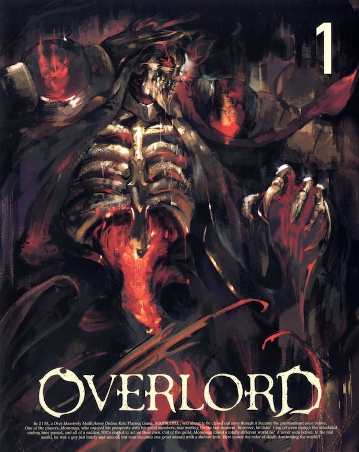

> Este artículo se irá ampliando sobre la marcha. Puedes volver aquí dentro de un tiempo y ver qué se ha añadido.

# Overlord

{width=350px .left}

El origen de **Overlord** es una serie de novelas ligeras japonesas, escritas por **Kugane Maruyama** con algo de arte por alguien que firma como *so-bin*. 

> Novelas ligeras, ¿de qué me estás hablando? Cuando alguien intenta explicar qué es eso de novela ligera, *light novel* o ライトノベル, suele hacer un paralelismo con lo que ahora se llama *young adult* como género o demografía (ya tanto me da una cosa que otra)... hablando de lo habitual que es estar relacionado con el mundo del manga y el anime, y de cómo se publica en tiradas de libros baratos... y sí, tiene un poco de todo esto, pero está también relacionado con asuntos estilísticos y de escritura. Párrafos cortos, profusión de diálogos y minimalismo en los argumentos, el principal objetivo es siempre la facilidad y fluidez de lectura. La gente que antes tenía blogs ahora escribe en Twitter. Pues lo mismo.
>
> Y suele incluir (como el manga shonen) uso de *furigana* para aclarar cómo se leen los *kanjis* que el público joven o con menos vocabulario puede desconocer (vocabulario de escritura, si se me entiende... en japonés puedes no conocer cómo se lee una palabra pero si la escuchas puedes conocer el significado). 

## Sinopsis

## Novelas ligeras

Las novelas comenzaron en 2010 de forma online, y desde el 2012 las publica en Japón el sello [Enterbrain](https://en.wikipedia.org/wiki/Enterbrain), perteneciente al grupo [Kadokawa](https://en.wikipedia.org/wiki/Kadokawa_Future_Publishing). A día de hoy han aparecido 16 libros, que van siendo traducidos al inglés por [Yen Press](https://en.wikipedia.org/wiki/Yen_Press) (cuyos dueños son de nuevo Kadokawa y Hachette)... y en español nos quedamos con las ganas. Están siendo publicadas en México por Panini México, pero inexplicablemente no en España. Y no han aparecido en formato digital, así que ni por medios ilegales pueden conseguirse... a menos que te conformes con traducciones *fanmade* realizadas con la gramática de cuatro chavales que han compartido sus ratos libres. Que el esfuerzo es de agradecer, por supuesto, pero lógicamente no están al nivel que deberíamos exigir.

1. **The Undead King** *(Fushisha no Ō)*
2. **The Dark Warrior** *(Shikkoku no Senshi)*
3. **The Bloody Valkyrie** *(Senketsu no Ikusa Otome)*
4. **The Lizardman Heroes** *(Rizādoman no Yūsha-tachi)*
5. **The Men of the Kingdom (Part 1)** *(Ōkoku no Otoko-tachi (Jō))*
6. **The Men of the Kingdom (Part 2)** *(Ōkoku no Otoko-tachi (Ge))*
7. **The Invaders of the Great Tomb** *(Daifunbo no Shinnyūsha)*
8. **The Two Leaders** *(Futari no Shidōsha)*
9. **The Caster of Destruction** *(Hagun no Mahō Eishōsha)*
10. **The Ruler of Conspiracy** *(Bōryaku no Tōchisha)*
11. **The Dwarven Crafter** *(Yama Kobito no Kōshō)*
12. **The Paladin of the Sacred Kingdom (Part 1)** *(Sei Ōkoku no Sei Kishi (Jō))*
13. **The Paladin of the Sacred Kingdom (Part 2)** *(Sei Ōkoku no Sei Kishi (Ge))*
14. **The Witch of the Doomed Kingdom** *(Mekkoku no Majo)*
15. **The Half Elf God-kin (Part 1)** *(Han Mori Yōsei no Shinjin (Jō))*
16. **The Half Elf God-kin (Part 2)** *(Han Mori Yōsei no Shinjin (Ge))*

## Manga

## Anime

