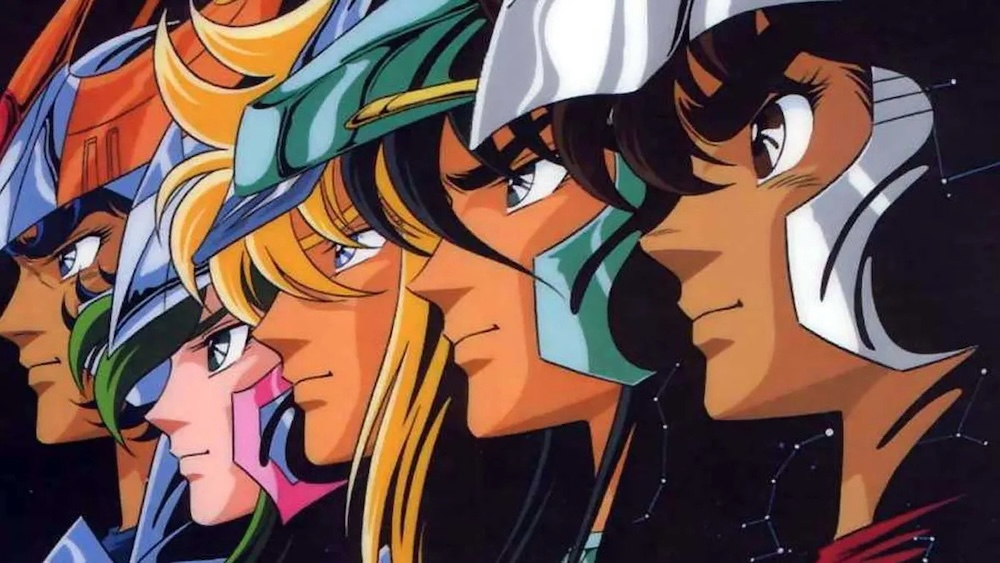
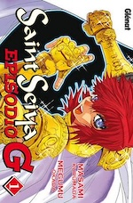
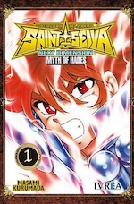
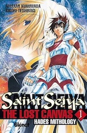
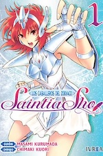
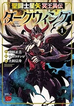
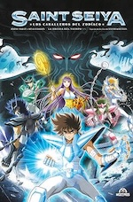
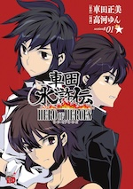
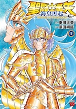
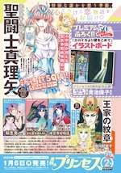

> Este artículo se irá ampliando sobre la marcha. Puedes volver aquí dentro de un tiempo y ver qué se ha añadido.

## Caballeros del Zodiaco

Si creciste en los 90, seguro que en algún momento gritaste “**¡Dame tu fuerza, Pegaso!**” mientras intentabas lanzar un meteoro de forma tan espectacular como poco efectiva. Y es que *Saint Seiya*, o como lo conocimos en muchos países, *Los Caballeros del Zodiaco*, marcó a una generación. Creado por [Masami Kurumada](https://en.wikipedia.org/wiki/Masami_Kurumada) en 1986, este *manga* y *anime* nos metió de lleno en un mundo de mitología griega con peleas épicas y unas armaduras doradas que todos quisimos tener.

La historia sigue a *Seiya* y sus amigos, los Caballeros de Bronce, que se parten el alma (y la cara) protegiendo a Atenea, *diosa* de la guerra y la sabiduría, contra enemigos cada vez más poderosos. ¿Cuántas veces vimos a los protagonistas seguir peleando cuando ya deberían estar en cuidados intensivos? Aún así se levantaban una y otra vez, con épica música de fondo y soltando un discurso sobre no rendirse.

El *anime* no solo fue un éxito en Japón, sino que arrasó en Europa y Latinoamérica, convirtiéndose en un fenómeno cultural y dejando huella en el *fandom*. Y aunque ha habido secuelas, *spin-offs*, *remakes* y hasta adaptaciones *live-action* (de las que es mejor hablar poco), el legado de *Saint Seiya* sigue brillando con la fuerza de una explosión galáctica.

> *La leyenda nos dice que los caballeros siempre aparecen cuando las fuerzas del mal intentan apoderarse del mundo… en un tiempo lejano existió un grupo de jóvenes que protegía a Atena, la diosa de la guerra; se les llamaba caballeros de Atena y siempre combatían sin armas. Se cuenta que con un revés de la mano eran capaces de desgarrar el cielo y que de un solo puntapié abrían grietas en la tierra. Hay de nuevo un grupo de caballeros con el mismo poder e idéntico valor que ha llegado a la tierra.*

## Las series manga

Cualquiera podría suponer que, dada la fama que tienen los **Caballeros del Zodiaco** en el mundo de habla hispana, todas las obras relacionadas han sido ya editadas y traducidas a nuestro idioma... y no. De hecho solo una pequeña parte, al igual que pocas de las obras de *Kurumada* han llegado hasta aquí.

Veamos el listado, actualizado a Febrero de 2025.



 

{.left width=150px}La serie original, comprendiendo las sagas del Santuario, Poseidón y Hades. La [edición *Kanzenban* de Planeta](https://www.whakoom.com/ediciones/523965/saint_seiya_los_caballeros_del_zodiaco-rustica) es la más actual que haya sido publicada al completo, contenida en 22 tomos.

Además también existen:

- *Saint Seiya Final Edition* (2021 - actualidad). También llamada edición *shinsōban*. Incluye algunos cambios y mejoras con respecto a la edición original. [Está siendo publicada](https://www.whakoom.com/ediciones/638684/saint_seiya_los_caballeros_del_zodiaco_final_edition-rustica) por Planeta, aún no se ha completado en Japón.
- *Saint Seiya: Episode Zero* (2017 - 2018, capítulos incluidos en el primer tomo de la *Final Edition*).
- *Saint Seiya: Origin* (2018) y *Saint Seiya: Destiny* (2018). Historias cortas, sin publicar en castellano, aparecerán en algún tomo de la *Final Edition*.
- *Saint Paradise* (1990), una parodia SD/chibi escrita y dibujada por *Takaya Yamada* de la que no tengo constancia de que haya aparecido en castellano.



 

{.left width=150px}Escrita y dibujada por *[Megumu Okada](https://en.wikipedia.org/wiki/Megumu_Okada)*, supervisada por *Kurumada*, nos cuenta lo sucedido durante los siete años anteriores al manga original, desde la muerte de *Aiolos* de Sagitario. [Publicada en castellano](https://www.whakoom.com/ediciones/5747/saint_seiya_episodio_g-rustica_con_sobrecubierta) por la extinta Glénat, convertida luego en EDT, y finalizada por Ivrea.

Además de los 20 tomos de este Episodio G, existen:

- *Saint Seiya: Episode.G – Volume 0* (2007 - 2008), un tomo único con una historia corta y una enciclopedia. Sin publicar en castellano.
- *[Saint Seiya: Episode G Assassin](https://www.whakoom.com/ediciones/395626/saint_seiya_episode_g_assassin-rustica_con_sobrecubierta)* (2014 - 2019, 16 tomos), cancelada en castellano tras publicar los cinco primeros tomos.
- *Saint Seiya: Episode.G – Requiem* (2020 - actualidad, 6 tomos), sin publicar en castellano.



 

{.left width=150px}La continuación canónica escrita y dibujada por el autor original, publicada a todo color en los tomos recopilatorios. Es a la vez secuela y precuela, contándonos la anterior guerra santa ocurrida durante el siglo XVIII con viajes en el tiempo, encarnaciones múltiples y demás mandangas.

Está [publicada por Ivrea en castellano](https://www.whakoom.com/ediciones/5750/saint_seiya_next_dimension_-_myth_of_hades-rustica_con_sobrecubierta) hasta el tomo 14, faltando aún dos para terminar. 



 

{.left width=150px}

Y aquí se nos empiezan a liar las cosas. En el mismo año 2006 en el que *Kurumada* creaba su precuela "oficial" y canónica, daba permiso a una segunda precuela escrita y dibujada por *Shiori Teshirogi*, una autora que venía del mundo del *shōjo*.

La historia tiene puntos de inicio similares a *Next Dimension*, y por lo que se cuenta ambos autores intercambiaban ideas durante la creación de ambas obras, haciendo esto aún más confuso. ¿Por qué? No lo sé. Así son las cosas.

[Publicada en castellano](https://www.whakoom.com/ediciones/5751/saint_seiya_the_lost_canvas-rustica_con_sobrecubierta) por Glénat/EDT.

Además de los 25 tomos de *Lost Canvas*, existen:

- *Saint Seiya: The Lost Canvas – Anecdotes* (2011 - 2016, 16 tomos). Historias cortas sin publicar en castellano. También conocido como *Lost Canvas Gaiden*.
- *Saint Seiya: The Lost Canvas – Extra Edition* (2021 - actualidad, 1 tomo). Más historias sin publicar en castellano.



 

{.left width=150px}Escrita y dibujada por *Chimaki Kuori*, nos cuenta una historia que discurre en paralelo al *manga* original, pero basada en esta ocasión en las *Saintias*, las... qué difícil sería traducir esto... las "*caballeras*" del zodiaco, en un giro con *[retcon](https://en.wikipedia.org/wiki/Retroactive_continuity)* para introducir esta nueva orden de guerreras protectoras de Atenea. 

En el manga original existía una turbia ley de máscaras que impedía a las mujeres caballero mostrar su rostro, el cambio para esta serie resulta interesante.

[Publicada en castellano](https://www.whakoom.com/ediciones/473155/saintia_sho_-_los_caballeros_del_zodiaco-rustica_con_sobrecubierta) por Ivrea.

Además de los 16 tomos, existen:

- *Saint Seiya: Saintia Shō – Bangai-hen* (2022 - actualidad). También conocida como *Saintia Shō Memories*. Historias cortas no publicadas en castellano, de hecho no he encontrado información sobre si se han llegado a recopilar en tomo en japonés.



 

{.left width=150px}

Un *isekai* sobre un estudiante de instituto que se despierta siendo un subordinado de Hades en su infierno. 

Escrita por *Kenji Saitō*, dibujada por Shinshū Ueda. Sin publicar en castellano.



 

{.left width=150px}

Si hay un país donde Los Caballeros del Zodiaco pegaron más fuerte que en España, es Francia. Allí *Jérôme Alquié* y *Arnaud Dollen* han creado su propia versión de la historia con personajes comunes pero con un nuevo argumento, con la idea de publicar un tomo centrado en cada uno de los cinco personajes originales.

Los tomos [están siendo publicados](https://www.whakoom.com/ediciones/642036/saint_seiya_-_los_caballeros_del_zodiaco_la_odisea_del_tiempo-cartone_64_pp) en castellano por Moztros.





{.left width=150px}

Un *crossover* escrito y dibujado por *Yun Kōga* que reúne a varios personajes de las obras creadas por *Kurumada* a lo largo de su extensa trayectoria.

¿Cómo va a esto a estar publicado en castellano, por favor? Pues claro que no, si la mayoría de obras de las que salen los personajes no han aparecido por aquí.



 

{.left width=150px}Escrito y dibujado por *Tsunakan Suda*. Una historia posterior a la saga de *Hades*, protagonizada por *Poseidón* y sus caballeros, que tienen que proteger la tierra *because of reasons*. Sin publicar en castellano.



 

{.left width=150px}

La última en llegar a este listado, y la primera de las colecciones en ser publicada en una revista *shōjo*. Cosas veredes. Escrita y dibujada por *Seira Shimotsuki*.

Voy a suponer que no es una obra canónica dentro del universo de *Saint Seiya* ya que la protagonista es una muchacha que consigue la armadura de pegaso sin encajar esta historia con ninguna de las otras obras. Por ahora sólo lleva pocos capítulos publicados (la portada a la izquierda es de un anuncio en la revista), aún sin recopilar en tomo en japonés, por lo que obviamente tampoco está publicada en castellano.




