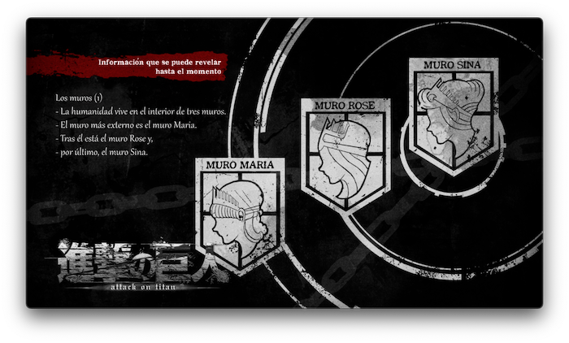

> Este artículo se irá ampliando sobre la marcha. Puedes volver aquí dentro de un tiempo y ver qué se ha añadido.

# Shingeki no Kyojin 進撃の巨人

También conocido como *Attack on Titan* en inglés o *Ataque a los Titanes* en España.

## Anime

Una lista con resúmenes de todos los episodios según los voy viendo. Naturalmente, *spoilers ahead*, no leas esta sección si no quieres estropear las sorpresas.

### Primera temporada

##### Episodio 1, La caída de Shiganshina (1ª parte)

Tremendo mundo este, en el que la humanidad vive dentro de tres grandes murallas concéntricas, protegiéndose de unos titanes locos de distintos tamaños. Conocemos a la chavalada que probablemente sean los protagonistas de todo esto: **Eren**, **Mikasa** y **Armin**. Sus distintas personalidades y ambiciones quedan ya parcialmente dibujadas en este primer capítulo, antes de que comience la destrucción por parte de varios titanes que atacan la ciudad.

##### Episodio 2, La caída de Shiganshina (2ª parte)

No sólo es invadida la ciudad, sino que los titanes traspasan el primer muro campando a sus anchas. Refugiados, hambruna, qué mal pinta todo. Pasa un año y los intentos de retomar los territorios perdidos tienen resultados catastróficos. Nuestros protagonistas, ahora huérfanos, deciden alistarse, entrando a formar parte de la **Tropa de Reclutas del Ciclo Nº104**, con lo que termina este prólogo de dos capítulos.

##### Episodios 3 y 4, La recuperación de la humanidad (1ª y 2ª parte)

El entrenamiento de toda la tropa de reclutas desde que se apuntan hasta que ya han pasado cinco años del ataque de los titanes y se licencian. Los diez alumnos con mejor puntuación (en no sabemos muy bien qué) tienen derecho a formar parte de la **Policía Militar**, y vivir con tranquilidad en las tierras centrales... pero todos los personajes molones que conocemos en estos dos capítulos van a escoger (por supuesto) formar parte del **Cuerpo de Exploración**, los que salen fuera de los muros.

Llegamos al día de graduación y quiere *la casualidad* que los titanes comiencen un ataque a la ciudad en la que se encuentran.

---

Durante el prólogo, el padre de Eren había salido de viaje, y no hemos vuelto a saber nada de él ni han intentado buscarlo. ¿Me he perdido algo? 

Hemos visto que Eren tiene de cuando en cuando algunos extraños sueños relacionados con su padre, e intuyo que algo de los que parecía sueño habrá sucedido de verdad, pero no quiero buscar más información no vaya a ser que me coma algún *spoiler* (*que ya me he tragado un par de ellos*).

---

## Enlaces de interés

- [Shingeki no Kyojin Wiki](https://attackontitan.fandom.com/wiki/Attack_on_Titan_Wiki).
- [Lista de episodios](https://en.wikipedia.org/wiki/List_of_Attack_on_Titan_episodes).
