> Este artículo se irá ampliando sobre la marcha. Puedes volver aquí dentro de un tiempo y ver qué se ha añadido.

[Flash Gordon](https://en.wikipedia.org/wiki/Flash_Gordon) lleva casi un siglo dando guerra. Nacido como tira cómica de [Alex Raymond](https://en.wikipedia.org/wiki/Alex_Raymond) en 1934 para competir con Buck Rogers, saltó casi inmediatamente al cine en forma de seriales de matiné, y desde entonces no ha dejado de reinventarse en cada generación: seriales en blanco y negro, series de imagen real, dibujos animados de sábado por la mañana, una película de culto absoluto en 1980 con [banda sonora de Queen](https://en.wikipedia.org/wiki/Flash_(Queen_song)) y varios intentos televisivos más recientes que han envejecido con desigual fortuna.

Esta página intenta poner en orden todo lo que ha dado de sí el personaje fuera de las viñetas.

## Timeline





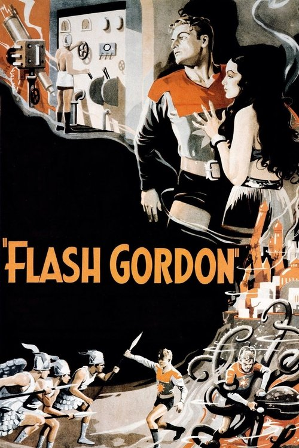{.left width=150px} 

*Primer serial de Universal protagonizado por [Buster Crabbe](https://en.wikipedia.org/wiki/Buster_Crabbe), adaptando los primeros arcos del cómic de Raymond. Flash, Dale Arden y el doctor Zarkov llegan al planeta Mongo y se enfrentan al emperador Ming. Fue el serial más caro de su época y un éxito enorme.*

Existen versiones resumidas en largometraje: [Rocket Ship](https://www.themoviedb.org/movie/356731-rocket-ship) (1938, estreno en cines) y [Spaceship to the Unknown](https://www.themoviedb.org/movie/359728-spaceship-to-the-unknown) (1966, montaje para televisión).





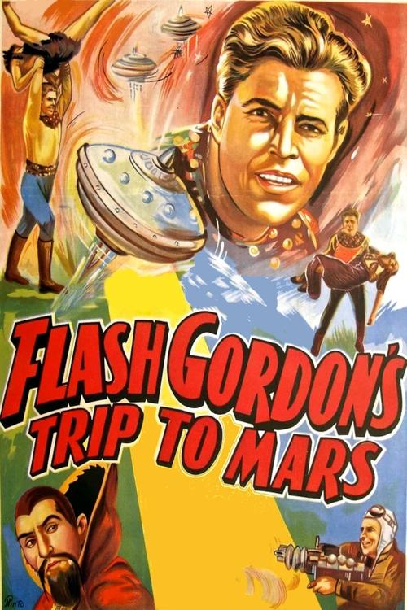{.left width=150px} {% badge "#ffffff" "[wikipedia](https://en.wikipedia.org/wiki/Flash_Gordon%27s_Trip_to_Mars)" %}

*Segundo serial, también con Crabbe. Ming vuelve, esta vez aliado con la reina marciana Azura, en una historia que originalmente iba a desarrollarse en Mongo y se reubicó en Marte para aprovechar el tirón de [La guerra de los mundos](https://en.wikipedia.org/wiki/The_War_of_the_Worlds_(1938_radio_drama)) de Orson Welles.*

Existen versiones resumidas en largometraje: [Mars Attacks the World](https://www.themoviedb.org/movie/406045-mars-attacks-the-world) (1938, estreno en cines) y [Deadly Ray from Mars](https://www.themoviedb.org/movie/564240-deadly-ray-from-mars) (1966, montaje para televisión).





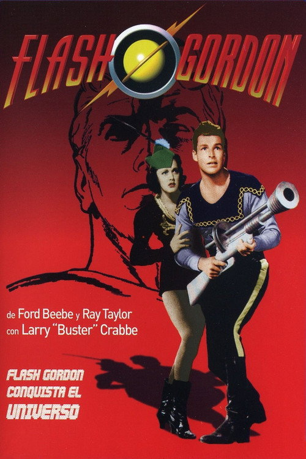{.left width=150px} 

*Cierre de la trilogía de seriales de Universal. Crabbe se enfrenta una última vez a Ming en Mongo, en una historia centrada en una plaga llamada "Death Dust". Considerado generalmente el mejor de los tres.*

Existen dos versiones resumidas en largometraje para televisión: [Purple Death from Outer Space](https://www.themoviedb.org/movie/113682-purple-death-from-outer-space) (1966) y [Peril from the Planet Mongo](https://www.themoviedb.org/movie/540161-peril-from-the-planet-mongo) (1966).





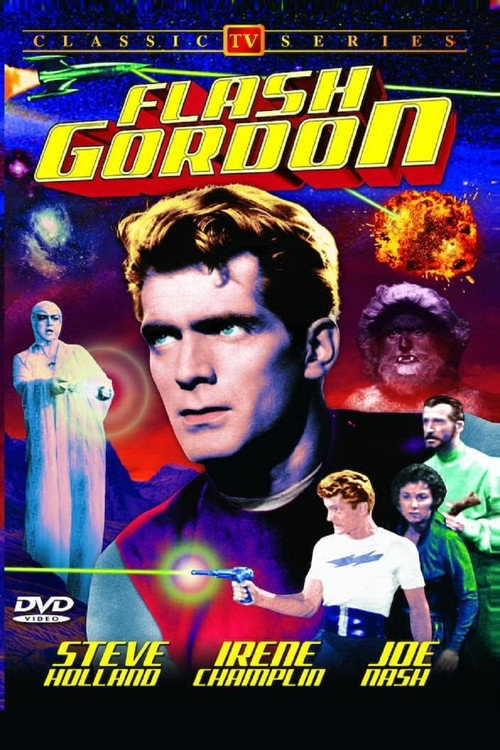{.left width=150px} 

*Serie de imagen real producida en Alemania occidental y emitida en EEUU. Steve Holland sustituye a Crabbe. Ambientada en un futuro lejano, sigue a los agentes de la Galactic Bureau of Investigation.*

No parecen estar preservados todos los episodios, o al menos yo no he conseguido encontrarlos completos por ningún lado. Varios sí están disponibles para ver en el [Internet Archive](https://archive.org/details/ep-18-the-rains-of-death/).





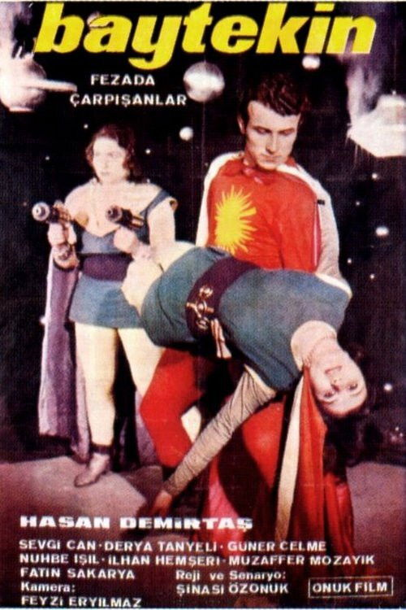{.left width=150px}

*También conocida como *Baytekin - Fezada Çarpışanlar*, una producción turca de bajo presupuesto que adapta libremente al personaje. Uno más de los muchos remakes turcos no oficiales de clásicos americanos.*





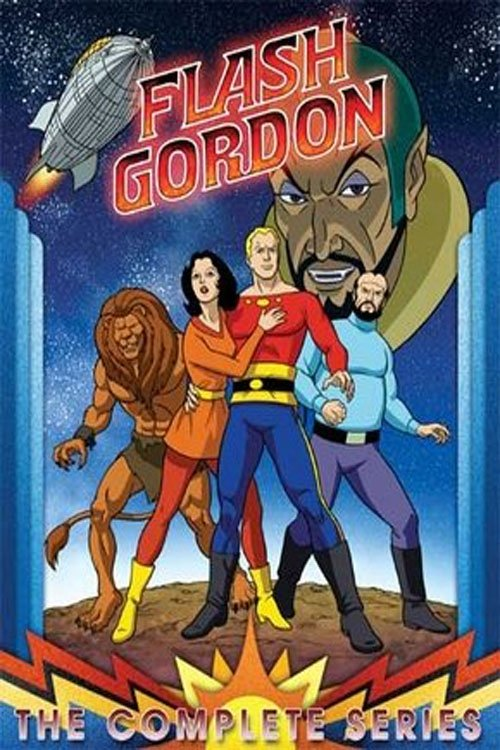{.left width=150px} 

*Producida por [Filmation](https://en.wikipedia.org/wiki/Filmation), recupera el espíritu de los seriales clásicos pero con la estética de la animación de sábado por la mañana. Fue una de las primeras series de animación americana en seguir arcos largos y continuados, en parte porque originalmente estaba pensada como un único largometraje.*





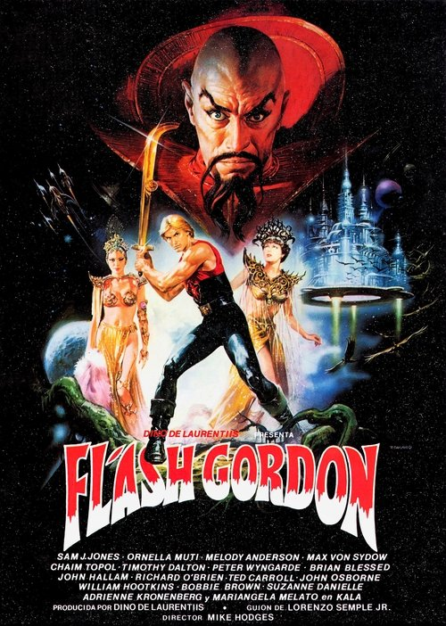{.left width=150px} 

*La película de [Mike Hodges](https://en.wikipedia.org/wiki/Mike_Hodges) producida por [Dino De Laurentiis](https://en.wikipedia.org/wiki/Dino_De_Laurentiis), con Sam J. Jones, Max von Sydow como Ming, Topol, Timothy Dalton y Brian Blessed. [Banda sonora de Queen](https://en.wikipedia.org/wiki/Flash_Gordon_(album)). Fracaso comercial moderado en su estreno y posterior película de culto absoluto. La que todos tenemos en la cabeza cuando se dice "Flash Gordon".*





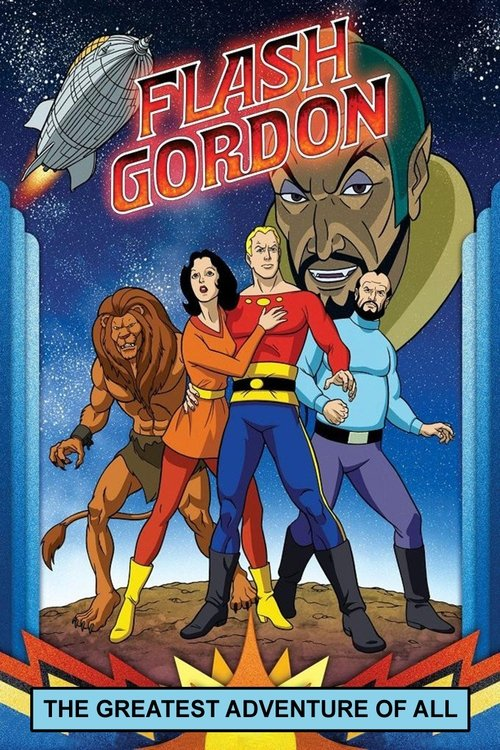{.left width=150px} 

*Telefilm de animación de Filmation, ensamblado en parte a partir de material que había quedado fuera de la serie de 1979. Funciona como pseudo-piloto / largometraje resumen de aquella continuidad.*





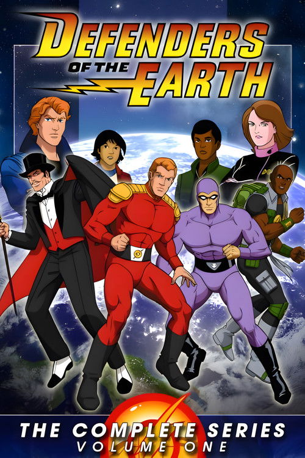{.left width=150px} 

*Crossover de King Features que junta a Flash Gordon, [The Phantom](https://en.wikipedia.org/wiki/Phantom_(comics)) y [Mandrake the Magician](https://en.wikipedia.org/wiki/Mandrake_the_Magician), con sus respectivos hijos, defendiendo la Tierra del año 2015 frente a Ming. Letra del tema de cabecera escrita por [Stan Lee](https://en.wikipedia.org/wiki/Stan_Lee).*





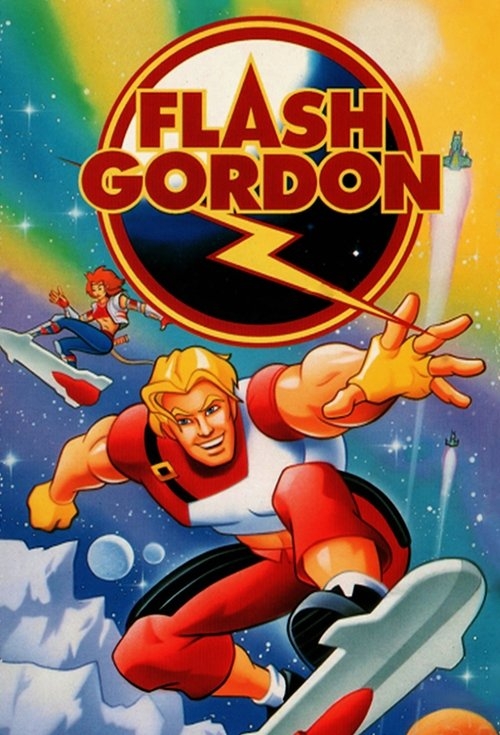{.left width=150px} 

*Reboot animado producido por [Hearst Communications](https://en.wikipedia.org/wiki/Hearst_Communications), con un estilo más oscuro y orientado a un público algo mayor que la versión de Filmation. Mezcla animación tradicional con CGI temprano.*





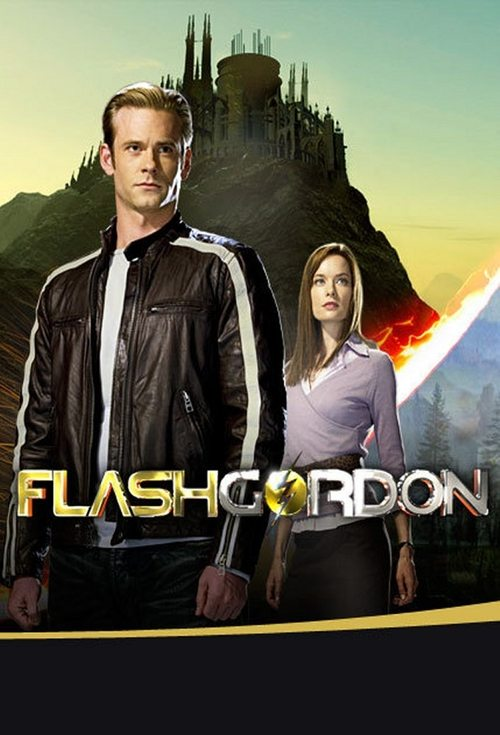{.left width=150px} 

*Serie de imagen real de [Sci Fi Channel](https://en.wikipedia.org/wiki/Syfy), con [Eric Johnson](https://en.wikipedia.org/wiki/Eric_Johnson_(actor)) como Flash. Reinterpreta la mitología clásica con un tono moderno y un presupuesto modesto que se nota. Cancelada tras una temporada.*




