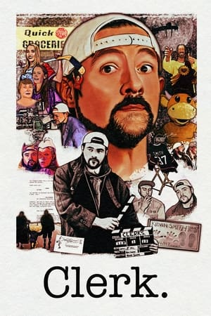

> Este artículo se irá ampliando sobre la marcha. Puedes volver aquí dentro de un tiempo y ver qué se ha añadido.

{.left}

A poco que recorrieras aunque fuera de modo tangencial el mundo *friki* durante los años 90 y principios de los 2000, debería sonarte el nombre de [Kevin Smith](https://en.wikipedia.org/wiki/Kevin_Smith). Director, guionista e icono de la cultura *nerd*, conocido por comedias irreverentes llenas de chistes zafios, referencias *frikis* y personajes verborreicos, ha dirigido una serie de películas que oscilan entre lo absurdo y lo filosófico, a menudo con el famoso dúo [Jay y Bob el silencioso](https://en.wikipedia.org/wiki/Jay_and_Silent_Bob).

Además se ha metido en todo tipo de proyectos: ha hecho cómics, ha sido escritor, productor, *podcaster*, y hasta ha tenido un par de cameos que seguro has visto sin saberlo. Pero lo que realmente lo distingue es su habilidad para hacer cine que no se toma a sí mismo demasiado en serio, mientras toca a veces temas más profundos... o los resume a referencias de *Star Wars*. 

> *Ya está bien, cretinos, sólo hay un retorno, y no es de ningún rey, es El Retorno del Jedi.*
>
> *[Randal](https://www.youtube.com/watch?v=5ERaPqg22Nc)*{.right}

Vamos a echar un vistazo a su filmografía e iré dejando por aquí enlaces a todas las reseñas de sus películas que vaya escribiendo.

## Las Películas

| Año  | Título                                                       | En el blog |
| ---- | ------------------------------------------------------------ | ----------- |
| 1994 | [Clerks](https://www.imdb.com/title/tt0109445/)              |             |
| 1995 | [Mallrats](https://www.imdb.com/title/tt0113749/)            |             |
| 1997 | [Chasing Amy](https://www.imdb.com/title/tt0118842/)         |             |
| 1999 | [Dogma](https://www.imdb.com/title/tt0120655/)               |             |
| 2001 | [Jay and Silent Bob Strike Back](https://www.imdb.com/title/tt0261392/) |             |
| 2004 | [Jersey Girl](https://www.imdb.com/title/tt0300051/)         | [20/01/25](/jersey-girl-el-kevin-smith-blandito/) |
| 2005 | [Cop Out](https://www.imdb.com/title/tt1385867/)             |             |
| 2006 | [Clerks II](https://www.imdb.com/title/tt0424345/)           |             |
| 2008 | [Zack and Miri Make a Porno](https://www.imdb.com/title/tt1007028/) |             |
| 2011 | [Red State](https://www.imdb.com/title/tt0873886/)           |             |
| 2014 | [Tusk](https://www.imdb.com/title/tt3099498/)                |             |
| 2016 | [Yoga Hosers](https://www.imdb.com/title/tt3838992/)         |             |
| 2019 | [Jay and Silent Bob Reboot](https://www.imdb.com/title/tt6521876/) |             |
| 2022 | [Clerks III](https://www.imdb.com/title/tt11128440/)         |             |
| 2024 | [The 4:30 Movie](https://www.imdb.com/title/tt28658276/)     |             |

## Otras cosas

Otras cosas a las que la palabra "película" quizá les viene grande.

| Año  | Título                                                    | En el blog |
| ---- | --------------------------------------------------------- | ---------- |
| 2016 | [Holidays](https://www.imdb.com/title/tt4419364/)         |            |
| 2018 | [Hollyweed](https://www.imdb.com/title/tt5372332/)        |            |
| 2022 | [Killroy was here](https://www.imdb.com/title/tt6993240/) |            |

## Sobre Kevin Smith

| Año  | ¿Qué es? | Título | En el blog |
| :--: | :------: | :----- | ---------- |
| 1999 | Libro | Kevin Smith y la Trilogía de New Jersey ([whakoom](https://www.whakoom.com/ediciones/276202/kevin_smith_y_la_trilogia_de_new_jersey-rustica_144_pp)) |  |
| 2005 | Libro | The Mallrats Companion ([goodreads](https://www.goodreads.com/book/show/3243524-the-mallrats-companion)) |  |
| 2005 | Libro | Silent Bob Speaks: The Selected Writings ([goodreads](https://www.goodreads.com/book/show/300885.Silent_Bob_Speaks)) |  |
| 2007 | Libro | My Boring-Ass Life: The Uncomfortably Candid Diary of Kevin Smith ([goodreads)](https://www.goodreads.com/book/show/300889.My_Boring_Ass_Life) |  |
| 2009 | Libro | Shootin' the Shit with Kevin Smith: The Best of the SModcast ([goodreads)](https://www.goodreads.com/book/show/6633415-shootin-the-shit-with-kevin-smith) |  |
| 2012 | Libro | Tough Shit: Life Advice from a Fat, Lazy Slob Who Did Good ([goodreads](https://www.goodreads.com/book/show/12405612-tough-shit)) |  |
| 2021 | Documental | Clerk ([imdb)](https://www.imdb.com/title/tt14024448/) |      |
| 2021 | Libro | Kevin Smith's Secret Stash: The Definitive Visual History ([goodreads)](https://www.goodreads.com/book/show/56897840-kevin-smith-s-secret-stash) | |

{.fixed-column1 .fixed-column2}

## Enlaces de interés

- Su [entrada en la Wikipedia](https://en.wikipedia.org/wiki/Kevin_Smith).
- Hay [una wiki propia en fandom.com](https://kevin-smith.fandom.com) sobre el director.
- Un [artículo en Den of Geek](https://www.denofgeek.com/movies/the-unmade-films-of-kevin-smith/) sobre las películas que pudieron ser y no llegaron a ser.

  
