Una lista cronológica, ordenada según los acontecimientos dentro del mundo de Star Wars.

Algunas de las cosas de esta lista estarán marcadas como , lo que significa que _la nueva oficialidad_ de Disney ya no las considera canónicas, pero yo sí, y aquí las cosas son como yo quiero. Esto es el **canon neverbot**.

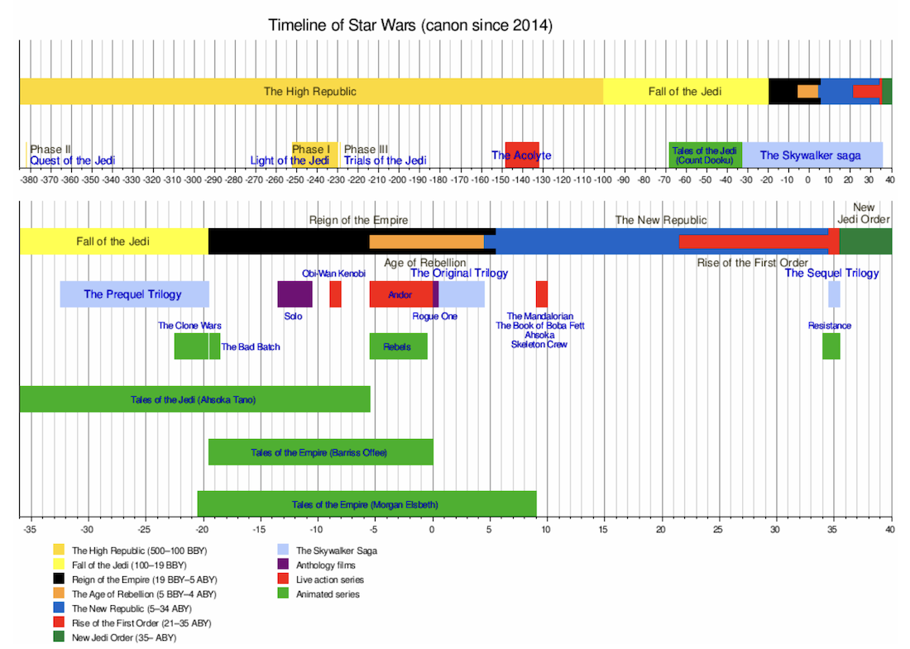

*[Wikipedia](https://en.wikipedia.org/wiki/Star_Wars#Fictional_timeline): dónde va cada cosa desde 2014, fecha de creación del nuevo canon Disney.*{.center}

## Timeline

Actualizado a Octubre de 2023.




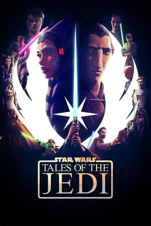{.left width=150px}*Adéntrate en las vidas de dos Jedi completamente diferentes, antes de las precuelas cinematográficas: Ahsoka Tano y el Conde Dooku.*



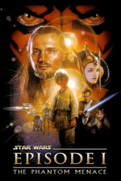{.left width=150px}*Un niño llamado Anakin Skywalker es encontrado por los Jedi Obi-Wan Kenobi y Qui-Gon Jinn. Juntos, intentan proteger a la Reina Amidala y luchar contra la amenaza de un malvado sith llamado Darth Maul y su señor Darth Sidious.*



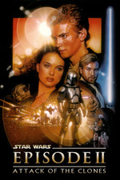{.left width=150px}*Continúa la historia de Anakin Skywalker, ahora un joven Jedi, mientras se convierte en el aprendiz de Obi-Wan Kenobi. A la vez que crece la tensión política en la República Galáctica con su ejército de clones, Anakin y Obi-Wan investigan un complot que afecta a la Senadora Amidala. La trama se complica con el romance secreto entre Anakin y Amidala, y la lucha de Anakin entre sus propias emociones y el atractivo lado oscuro de la Fuerza.*



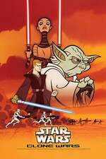{.left width=150px} *Dirigida por Genndy Tartakovsky, se centra en las intensas batallas entre los Jedi y los separatistas, así como en la evolución de personajes como Anakin Skywalker y el papel de los soldados clon en la guerra. A lo largo de sus episodios, presenta momentos épicos de combate, duelos de sables de luz y la creciente amenaza del Conde Dooku y el general Grievous.*



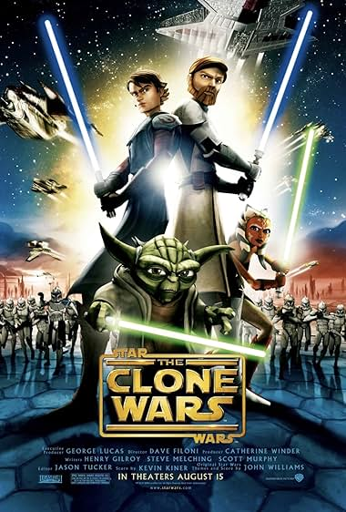{.left width=150px} *Largometraje de animación que sirve como introducción a la serie de televisión del mismo nombre. La historia se desarrolla durante las Guerras Clon y sigue a los Jedi Obi-Wan Kenobi y Anakin Skywalker, junto con su nueva aprendiz Ahsoka Tano, mientras luchan contra las fuerzas separatistas.*



{.left width=150px}*La serie de animación se centra en el conflicto de las Guerras Clon y sigue las vidas y las misiones de los Jedi, en particular Anakin Skywalker y su aprendiz Ahsoka Tano, mientras lideran las fuerzas de la República contra los separatistas liderados por el Conde Dooku. La serie también explora una variedad de otros personajes y ubicaciones en la galaxia, y aborda temas como la moralidad, la guerra y el lado oscuro de la Fuerza. A lo largo de sus siete temporadas, "The Clone Wars" se convierte en una parte integral del canon de Star Wars, profundizando en la mitología y la historia de la galaxia mucho más allá de lo que se muestra en las películas.*



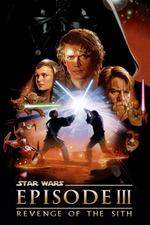{.left width=150px}*Culminación de la trilogía de precuelas, muestra el ascenso de Palpatine al poder y el colapso de la República Galáctica. La relación entre Anakin y el Maestro Jedi Obi-Wan Kenobi se deteriora, y Anakin es seducido por el lado oscuro de la Fuerza. Además, se revela la ejecución de la Orden 66, que lleva al exterminio de los Jedi y al nacimiento del Imperio Galáctico.*



{.left width=150px}*Serie de animación que sigue a un grupo de soldados clon con habilidades únicas conocidos como la Clone Force 99 "The Bad Batch", después de los eventos de "Star Wars: The Clone Wars", mientras tratan de encontrar su lugar en una galaxia en cambio tras el final de las Guerras Clon y la ascensión del Imperio Galáctico.*



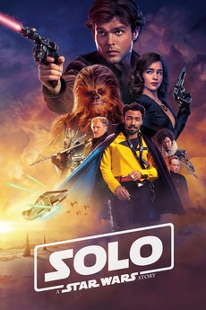{.left width=150px}*Seguimos la juventud de Han Solo mientras escapa de su planeta natal, Corellia, y se involucra en actividades criminales en el inframundo galáctico, conociendo a Chewbacca y Lando Calrissian, y consiguiendo su icónica nave, el Halcón Milenario.*



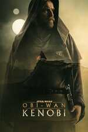{.left width=150px}*Vuelve el icónico Jedi Obi-Wan Kenobi, interpretado por Ewan McGregor, diez años después de los eventos de "Star Wars: Episode III - Revenge of the Sith". Seguimos a Obi-Wan mientras se esconde en el desértico planeta Tatooine, vigilando desde las sombras al joven Luke Skywalker.*



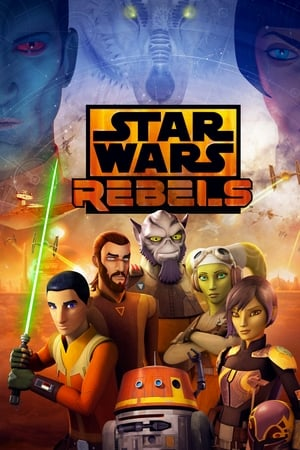{.left width=150px}*"Star Wars Rebels" es una serie de animación situada entre los eventos de "Star Wars: Episode III - Revenge of the Sith" y "Star Wars: Episode IV - A New Hope". La serie sigue las aventuras de un variado grupo de rebeldes que luchan contra el Imperio Galáctico: Ezra Bridger, un joven con habilidades sensibles a la Fuerza; Kanan Jarrus, un Jedi superviviente; Hera Syndulla, la piloto y líder; Sabine Wren, una artista y experta en explosivos; Garazeb "Zeb" Orrelios, un guerrero Lasat; y Chopper, un droide astromecánico.*



{.left width=150px}*Seguimos al personaje de Cassian Andor, interpretado por Diego Luna, quien previamente apareció en la película "Rogue One: A Star Wars Story", cinco años antes de los eventos de "Rogue One", sumergiéndonos en el mundo del espionaje y la resistencia contra el Imperio Galáctico.*



{.left width=150px}*Justo antes de los eventos de "Star Wars: Episode IV - A New Hope", conocemos a un grupo de rebeldes liderados por Jyn Erso, quien es reclutada por la Alianza Rebelde para robar los planos de la Estrella de la Muerte, la temible estación espacial del Imperio Galáctico capaz de destruir planetas enteros.*



{.left width=150px}*Primera película de la trilogía original de Star Wars. Luke Skywalker se une a la Alianza Rebelde para enfrentarse al malvado Imperio Galáctico. Con la ayuda de Obi-Wan Kenobi, la Princesa Leia y Han Solo, Luke se embarca en un viaje para destruir la Estrella de la Muerte y restaurar la paz en la galaxia.*



{.left width=150px}*Segunda película de la trilogía original de Star Wars. La película continúa la lucha de la Alianza Rebelde contra el Imperio Galáctico y sigue a Luke Skywalker, Leia Organa, Han Solo tras la destrucción de la Estrella de la Muerte. Seremos testigos del entrenamiento de Luke como Jedi por parte de Yoda en el planeta Dagobah, mientras que Han y Leia buscan refugio en la ciudad de las nubes de Bespin, solo para caer en una trampa tendida por el temible Darth Vader.*



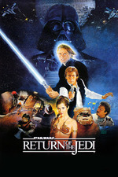{.left width=150px}*Tercera película de la trilogía original de Star Wars. Continúa la lucha de la Alianza Rebelde contra el Imperio Galáctico y sigue a Luke Skywalker, Leia Organa, Han Solo y sus aliados mientras se preparan para el enfrentamiento final con el Emperador Palpatine y su aprendiz, Darth Vader.*



{.left width=150px}*Sigue las aventuras de un cazarrecompensas conocido simplemente como "El Mandaloriano" o "Mando", miembro de una antigua orden de guerreros conocidos por su código de honor. Mando es contratado para rastrear y capturar a un misterioso niño alienígena de la misma especie que Yoda. A medida que Mando se involucra en la búsqueda, desarrolla un fuerte vínculo con el niño y se convierte en su protector. En la segunda temporada, Mando se embarca en una misión para encontrar al hogar del niño, buscando a otros mandalorianos que puedan ayudarlo.*



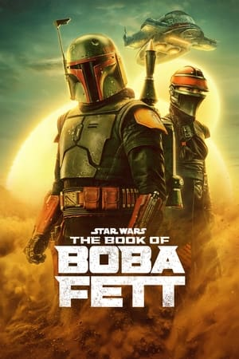{.left width=150px}*Tras los eventos de la segunda temporada de "The Mandalorian", seguimos a Boba Fett y Fennec Shand mientras asumen un papel de liderazgo en el inframundo del crimen en Tatooine. La serie aborda cómo Boba Fett recuperó su icónica armadura y su regreso a la escena galáctica después de ser devorado por el Sarlacc en "Return of the Jedi".*



{.left width=150px}*El Mandaloriano y Grogu viajan hasta Mandalore junto a Bo-Katan Kryze para unir a varias facciones de Mandalorianos y reclamar el planeta.*



{.left width=150px}*Seguimos el viaje de Ahsoka tras su última aparición durante "The Book of Boba Fett", donde conoció a Grogu.*



{.left width=150px}*Serie animada que se centra en la vida de Kazuda Xiono, un joven piloto de la Resistencia. Poco antes de los eventos de "The Force Awakens", Kazuda Xiono es reclutado por Leia Organa y Poe Dameron para trabajar como espía y descubrir información sobre la Primera Orden, una organización que amenaza a la galaxia.*



{.left width=150px}*Primera película de la tercera trilogía de Star Wars, ambientada décadas después de los eventos de "Return of the Jedi". La película sigue a una nueva generación de personajes mientras se enfrentan a la amenaza de la Primera Orden, sucesora del Imperio Galáctico. La trama se centra en Rey, una chatarrera con un misterioso pasado, Finn, un exsoldado de la Primera Orden en busca de redención, y Poe Dameron, un piloto de la Resistencia. Juntos, se embarcan en una misión para encontrar a Luke Skywalker, el último Jedi, quien ha desaparecido. Mientras tanto, el villano Kylo Ren, seguidor del Lado Oscuro de la Fuerza, busca consolidar su poder y encontrar a Luke.*



{.left width=150px}*Siguen las aventuras del joven piloto Kazuda Xiono como espía de la Resistencia, en paralelo a los eventos de "The Last Jedi". A medida que la serie avanza, la amenaza de la Primera Orden se vuelve más evidente y Kazuda y sus aliados se ven involucrados en conflictos más peligrosos.*



{.left width=150px}*Continúa la historia de la tercera trilogía de Star Wars, siguiendo a Rey, Finn, Poe Dameron y Kylo Ren mientras luchan por sus respectivas causas, poco después de los eventos de "The Force Awakens", centrándonos en el entrenamiento de Rey como Jedi por parte de Luke Skywalker.*



{.left width=150px}*Conclusión de la tercera trilogía de Star Wars y la saga Skywalker en su conjunto. La película sigue a Rey, Finn, Poe Dameron y sus aliados mientras se enfrentan a la resurgida amenaza del Emperador Palpatine y la Última Orden. La trama se desarrolla después de los eventos de "The Last Jedi" y se centra en la búsqueda de Rey por encontrar su verdadera identidad y su conexión con la Fuerza. Mientras tanto, Kylo Ren continúa su conflicto interno y se convierte en el nuevo líder de la Primera Orden.*




## Fuera de orden y continuidad




{.left width=150px}



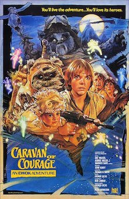{.left width=150px}



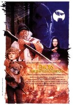{.left width=150px}



{.left width=150px}



{.left width=150px}



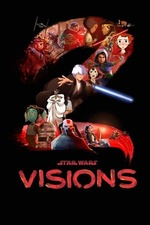{.left width=150px}



