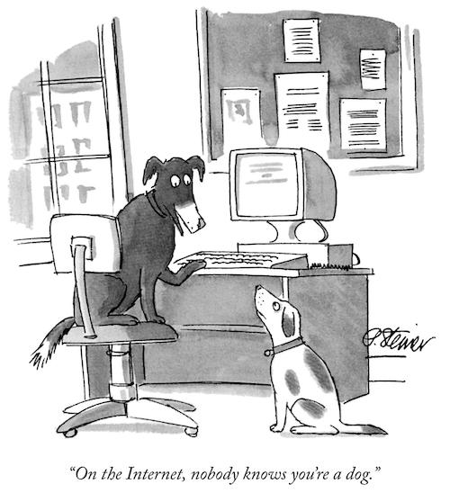

Esta es la página personal de Iván Alonso. Si nos conocemos quizá haya sido con el nombre de **Folken** ([muds](http://en.wikipedia.org/wiki/MUD) varios, [cYbErDaRk.NeT](http://www.cyberdark.net/index2.php)), **Ddraencara** ([XBox Live](https://live.xbox.com/es-ES/Profile?pp=0&GamerTag=ddraencara) o [World of Warcraft](http://eu.battle.net/wow/en/character/shendralar/Ddraencara/) por ejemplo) o, desde hace ya tiempo, **neverbot**, el _nick_ más habitual que utilizo.

Así puedes encontrarme en:

*   [neverbot.com](https://neverbot.com), obviamente.
*   [Tumblr](http://neverbot.tumblr.com/)
*   [Instagram](http://instagram.com/neverbot)
*   [Letterboxd](http://letterboxd.com/neverbot/)
*   ~~[Twitter](http://twitter.com/neverbot)~~. [Ya no uso Twitter](./not-on-twitter-anymore), aunque aún mantengo la cuenta.
*   [Flickr](http://www.flickr.com/photos/neverbot/). No lo utilizo desde 2016, aunque aún mantengo la cuenta.

y en muchos otros lugares. Con mi nombre real estoy en:

*   [LinkedIn](http://www.linkedin.com/in/ivanalonso) (red profesional)
*   ~~Facebook (no profesional)~~. [Ya no uso Facebook](https://www.instagram.com/p/_FU_gySxMi/).

Muchos lugares y muy poco tiempo...

[_Peter Steiner en The New Yorker, 5 de julio de 1993_](https://en.wikipedia.org/wiki/On_the_Internet,_nobody_knows_you%27re_a_dog)

Si quieres ponerte en contacto conmigo para cualquier tema, déjame una mención en [@neverbot en Twitter](http://twitter.com/neverbot).