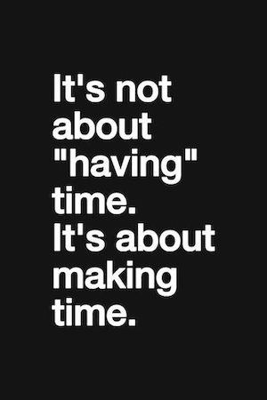

{.right width=40%}

Durante el año 2022 sucedió algo lamentable y ridículamente inesperado en mi vida adulta, o siquiera desde que tengo uso de razón, y es que creo que a lo largo de todo el año no terminé ningún libro. Reitero el "creo", porque ahora mismo no consigo recordar ningún libro concreto, así que podría estar equivocado.

Empecé muchos, dejé medio docena a medio leer, otra media docena empezados del año anterior en los que he ido avanzando algunos capítulos aquí y allá... pero 2022 fue un año muy complejo a todos los niveles, en el que la vida personal y profesional me tuvo atrapado hasta el punto de no encontrar apenas ratos sueltos para dedicárselos a unas páginas, y yéndome a dormir casi cada día derrotado de cansancio, sin ser capaz ni de leer antes de caer dormido. Leí mucho tebeo, pero ese no es el tema.

Es necesario arreglar esto durante los próximos años, y remontar el buen hábito de la lectura. Conseguir además encontrar tiempo para escribir un pequeño *post* con alguna reseña quizá sea ya ciencia-ficción, pero al menos hay que intentarlo. Esta página irá recogiendo los artículos que escriba sobre los libros que vaya leyendo (orden cronológico inverso):

- [Panfleto para seguir viviendo](/panfleto-para-seguir-viviendo/), de Fernando Díaz.
- [Nada Importa](/nada-importa-el-libro), de Jesús Terrés.
- [Futuro, ¿Qué futuro?](/futuro-¿que-futuro/) de Santiago Niño-Becerra.
- [El espíritu del Mago](/el-espiritu-del-mago-de-javier-negrete/), Javier Negrete.
- [El Sr. Penumbra y su librería 24 horas abierta](/el-respetable-oficio-de-traductor/), Robin Sloan.
- [Ready Player One](/el-respetable-oficio-de-traductor/), Ernest Cline.
- [Pórtico](/portico-de-frederik-pohl/), Frederik Pohl.
- [La saga de Geralt de Rivia](/la-saga-de-geralt-de-rivia-de-andrzej-sapkowski/) al completo, de Andrzej Sapkowski. Otro post sobre [Tiempo de Odio](/tiempo-de-odio-de-andrzej-sapkowski/), el cuarto libro.
- [Organízate con eficacia](/organizate-con-eficacia-de-david-allen-el-libro-no-el-metodo/), de David Allen.
- [La trilogía de Thrawn](/la-trilogia-de-thrawn-de-timothy-zahn/), de Timothy Zahn.
- [El Legado](/el-legado-de-rasalvatore/), de R. A. Salvatore.
- [Muy pronto seré invencible](/muy-pronto-sere-invencible-de-austin-grossman/), de Austin Grossman.
- [Al borde de los treinta](/al-borde-de-los-treinta/), de Mike Gayle.
- [El Hacker y las hormigas, versión 2.0](/el-hacker-y-las-hormigas-version-20/), de Rudy Rucker.
- [La noche roja](/la-noche-roja-de-leon-arsenal/), de León Arsenal.
