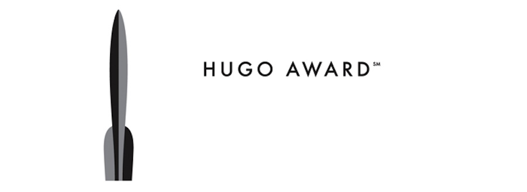

Es un proyecto de lectura tan válido como pueda serlo el de “*todos los libros cuyos títulos no tengan la letra a*”. Es decir, una excusa para leer. Leer más, no necesariamente mejor, pero al menos con un criterio de partida.

Desde 1953 se conceden los [**premios Hugo**](http://en.wikipedia.org/wiki/Hugo_Award) a las mejores obras en los campos de la fantasía y la ciencia ficción – es decir, son premios *de género*, vaya el aviso por delante –. Son votados por los visitantes (de pago) de la convención *WorldCon* y, dado que no existen normas escritas sobre qué califica a una obra para que esta sea considerada fantasía o ciencia ficción, más que el hecho de que sean propuestas para votación a principios de año, podría decirse que son unos premios bastante democráticos. No es que esto sea bueno o malo *per se*, pero explica algunas de las obras premiadas.

*El logo es un cohete. Bien.* {.center}

Existen numerosas categorías, aunque quizá las más importantes sean las de relato y novela, siendo esta última la que más me interesa a mí, que es lo que importa en este caso. Como peculiaridades, en 1954 y 57 no hubo premios de novela, pero desde mediados de los noventa se entregan también los *retrohugos* para solventar que haya habido ediciones de la *WorldCon* sin sus respectivos premios, habiendo “solucionado” ya los años 46, 51 y 54.

Por si fueran pocos libros, en al menos tres ocasiones se han producido empates de votos (66, 93 y 2010), teniendo estos años dos novelas ganadoras *ex aequo*. Y por si esto a su vez fuera poco, en ocasiones los premios han recaído en terceras, cuartas o quintas partes de alguna saga, lo que me obligará quizá a leerlas enteras. Por suerte la esperanza de vida de nuestra civilización es bastante alta.

Algunos contras tenía que tener este plan de dominación mundial: ciertos premios son inexplicables. En 1983 la cuarta parte de la saga de la *Fundación* de *Isaac Asimov* recibió el premio, obligándome a leer las tres anteriores, aparentemente de mayor calidad a tenor de las reseñas que he leído. En 2003 *Homínidos*, primera parte de una trilogía escrita por *Robert J. Sawyer*, un escritor de *best sellers* canadiense – el año que la convención se celebró en Canadá –. En 2001 fue para la cuarta parte de *Harry Potter*. Premios con historias sin terminar, o premios tardíos porque no nos atrevimos a darlos en el primer libro.

Pero teniendo en cuenta que se han entregado ya 65 premios *Hugo* de novela, creo que hay mucho y muy bueno que leer antes de llegar a las malas obras. Cinco libros de *Heinlein*, cuatro de *Lois McMaster Bujold*, obras creadoras de nuevos géneros como el *Neuromante* de *William Gibson*, clásicos de *Clarke*, *Zelazny* o *Dick* y un largo etcétera.

Existen otros premios, como el [*Philip K. Dick*](http://en.wikipedia.org/wiki/Philip_K._Dick_Award) que se entrega desde el 1983, los premios [*Nebula*](http://en.wikipedia.org/wiki/Nebula_Award) desde el 66 (considerados junto a los *Hugo* como los más importantes), los entregados por la revista *[Locus](http://en.wikipedia.org/wiki/Locus_Award)* desde 1971, el [*John W. Campbell Memorial*](http://en.wikipedia.org/wiki/John_W._Campbell_Memorial_Award_for_Best_Science_Fiction_Novel) desde 1973 o, más cercanos, los premios [*Ignotus*](http://es.wikipedia.org/wiki/Premio_Ignotus) a la mejor novela española y extranjera, desde 1991. Cualquiera de ellos sería perfectamente válido como proyecto de lectura y, en ocasiones, incluso coinciden: *Pórtico*, de *Frederik Pohl* ganó los premios *Hugo*, *Locus*, *Nebula* y *John Campbell Memorial*. *Neuromante* de *William Gibson* ganó *Nebula*, *Dick* y *Hugo*. Y así un largo etcétera.

¿No es un proyecto de lectura fabuloso? Aquí iré apuntando los que vaya leyendo. Avisad si tenéis alguna recomendación especial.

Dejo en esta página constancia de las novelas galardonadas con un premio Hugo que voy leyendo, hasta completar las 65 (¡glups!) que lo han recibido hasta el momento de escribir estas líneas.

[Listado de novelas premiadas (en castellano)](https://es.wikipedia.org/wiki/Premio_Hugo_a_la_mejor_novela).

* **[Pórtico](/portico-de-frederik-pohl/)**, de Frederik Pohl.
