> Este artículo se irá ampliando sobre la marcha. Puedes volver aquí dentro de un tiempo y ver qué se ha añadido.

# **Mushoku Tensei: Isekai Ittara Honki Dasu**

También conocido como *Mushoku Tensei: Jobless Reincarnation* en inglés, o *Mushoku Tensei: Reencarnación desde cero* en España.

## Anime

Una lista con resúmenes de todos los episodios según los estoy volviendo a ver. Naturalmente, *spoilers ahead*, no leas esta sección si no quieres estropear las sorpresas.

### Primera temporada, primera parte

##### Episodio 1, Reencarnación desde cero

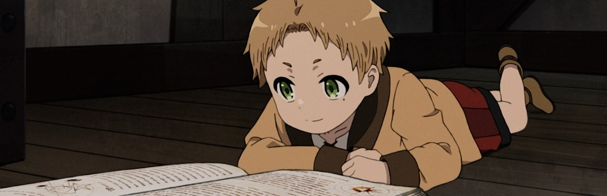

Nuestro protagonista, *nini* [*hikikomori*](https://en.wikipedia.org/wiki/Hikikomori) de manual de primero de anime, muere por circunstancias que nos dan igual y se reencarna en **Rudeus**, un recién nacido en un mundo de fantasía. La excusa del [*isekai*](https://en.wikipedia.org/wiki/Isekai) la podemos ignorar porque va a tener bastante poco peso en la mayor parte de la historia, salvo para servirnos de narrador con la voz del señor adulto original que va descubriendo este nuevo mundo junto al espectador.

Conocemos a los padres de Rudeus: **Paul Greyrat** el espadachín y **Zenith** la sanadora (la *healer*). Cero información por ahora sobre el mundo, su gobierno, a qué se dedican estos padres o por qué viven en este lugar. Pero Rudeus, teniendo en cuenta que su mente es en realidad la de un treintañero, muestra interés por todo a su alrededor y aprende a hablar, leer y ¡hacer magia! a muy temprana edad. Los padres contratan a una maestra de magia para entrenar a nuestro protagonista, y así aparece **Roxy** (un tipo de demonio, lo que es patente por tener el pelo azul, por lo visto).

##### Episodio 2, Profesora

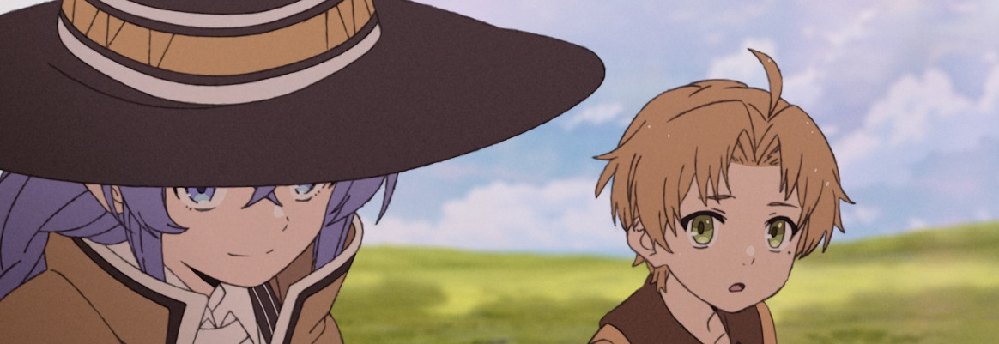

Esto avanza rápido. Pasan varios años (**Rudeus** celebra su quinto cumpleaños) en los que **Roxy** enseña al joven mago todo lo que sabe, hasta que el alumno supera a la maestra y esta acaba marchándose de viaje. Subimos de nivel hasta poder usar *magia de nivel sagrado* (y descubrimos que existen los niveles *principiante, intermedio, avanzado, sagrado, real, imperial y divino*, y los tipos de magia *ofensiva, de curación y de invocación*)

##### Episodio 3, Un amigo

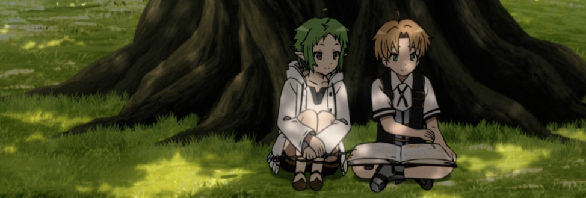

**Rudeus** utiliza su recién encontrada confianza en sí mismo para superar algunos de los miedos de su vida anterior y salir a su nuevo "mundo real" a conocer gente, haciendo un nuevo amigo: **Sylph**. ¡Sorpresa! Piensa que era un chico y tras una serie de enredos descubre que era una chica, medio elfa. No nos lo esperábamos para nada `</sarcasmo>`. Episodio prototípico que hemos visto mil veces en otras series.

##### Episodio 4, Reunión familiar de emergencia

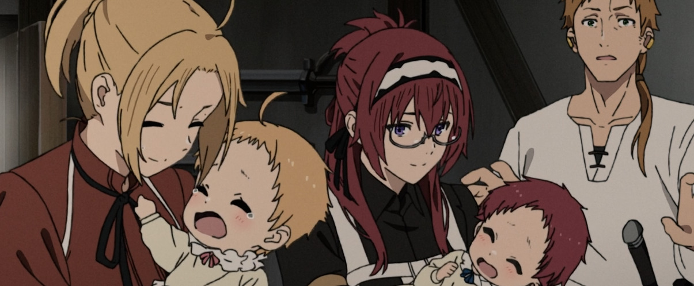

Qué rápido pasan las cosas al inicio de esta serie. La madre de **Rudeus** está embarazada... pero también **Lilia**, la sirvienta de esta curiosa familia, ambas de **Paul**, en un culebrón interesante. Nace una hermana (**Norn**) y una medio-hermana (**Aisha**), y ya han pasado dos años desde que se marchó **Roxy**, cuando llega una carta suya: ya ha avanzado hasta el nivel de *magia real* (los magos de este nivel pueden contarse con los dedos de una mano, comenta Paul), y recomienda a Rudeus que debe seguir estudiando en la *Universidad de la Magia de Ranoa*.

Nuestro protagonista decide que si va a esta escuela quiere hacerlo con **Sylph**, pero su familia sólo podría pagar una matrícula, así que decide empezar a trabajar (¿explotación infantil?) para poder llevar a su amiga. Aparentemente Paul le encuentra un trabajo, que aún no sabemos cuál será, cuando llega **Ghislaine**, una espadachina *mujer-bestia*, para llevárselo en carro no sabemos muy bien a dónde.

Algo más de trasfondo videojueguil: existen tres estilos de esgrima: *Dios de la Espada*, *Dios del Agua* y *Dios del Norte*. Paul es nivel *avanzado* en los tres. ¿Suponemos que los niveles son los mismos que en la magia? Vamos a pensar que sí.

---

##### El primer cambio de contexto

Una de las peculiaridades de esta serie, de las que a la vez más me agradan y más me molestan, es que nos encontramos a cada poco con puntos de inflexión que en cualquier otro tipo de narrativa podrían ser lo suficientemente importantes como para ser algo como un final de temporada, cuando aquí no tienen apenas relevancia alguna. 

Al terminar el cuarto capítulo (sólo llevamos cuatro, ojo), encontramos el primero de estos puntos de inflexión: el protagonista abandona el lugar en el que se encontraba, y podemos olvidarnos durante mucho tiempo de todos los personajes, situaciones y argumentos que se estuvieran desarrollando. En una serie de imagen real podría haber sido un final de temporada y comenzar la siguiente con los nuevos personajes que se van a presentar, mientras que aquí sólo es un descanso entre capítulos. Prosigamos.

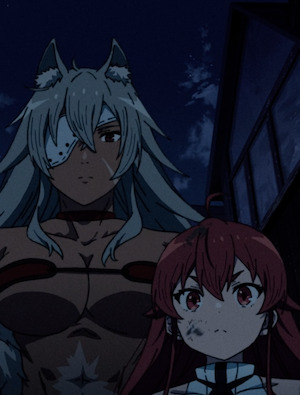{.right}

---

##### Episodio 5, Una señorita y violencia

Rudeus conoce a parte de la familia Greyrat, nobles en la lejana ciudad de *Roa*, que quieren que sea el nuevo tutor de su joven hija **Eris**, el personaje [tsundere](https://en.wikipedia.org/wiki/Tsundere) por excelencia, que ya faltaba uno así en la serie. A mí este tipo de personajes se me hacen bola, pero asumo que tienen sus defensores. 

El resto del episodio es Rudeus intentando ganarse el respeto de Eris con un engaño con un falso secuestro que se tuerce y acaba siendo real, y al final le vemos hacer algo de magia decente y a Ghislaine demostrando en un espectacular rescate final que está a otro nivel. Aprendemos de ella que es una "*Rey de la Espada*", en un término que quizá debería traducirse mejor y añadirle género, pero qué sé yo de esto.

Nuestro protagonista es contratado para hacer de tutor los próximos cinco años, hasta que cumpla doce, así que ya podemos ir acostumbrándonos al nuevo lugar.

##### Episodio 6, Un día libre en Roa

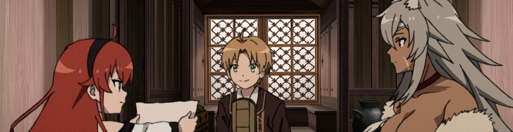

Día de visita al mercado, episodio totalmente prescindible. De vez en cuando hay unos acercamientos entre los dos niños (que no llegan a los diez años) que serían graciosos si no recordásemos que de alguna forma dentro de Rudeus lo que hay en realidad es un señor de más de treinta. *Creepy, disturbing*. Quiero pensar que poco a poco se ha ido convirtiendo también en un niño, pero la verdad es que los espectadores generalmente no sabrán cómo enfocar esas situaciones.

Datos interesantes que sacamos: 

- El grupo de aventureros de Ghislaine, Paul y Zenith se llamaba **Los Colmillos del Lobo Negro**. 
- *Roa* es la ciudad más grande de la región de *Fittoa* del reino de *Asura*.
- Hay una ciudadela volante dando vueltas por ahí desde hace 400 años: la fortaleza de **Perugius**, uno de los tres héroes que derrotaron a **Laplace**, el Dios Demonio. Esto ahora mismo nos da igual, pero hay aquí un trasfondo de qué sucede en este mundo de fantasía que se irá ampliando poco a poco. 

##### Episodio 7, Lo que yace más allá del esfuerzo

Otro episodio prescindible: Eris aprende a bailar para la fiesta de su décimo cumpleaños, llega la fiesta, y los protagonistas se van haciendo más amigos. Al final del episodio nos damos cuenta de que una extraña esfera rojiza ha empezado a flotar sobre la ciudad con muy mala pinta.

##### Episodio 8, Punto de Inflexión 1

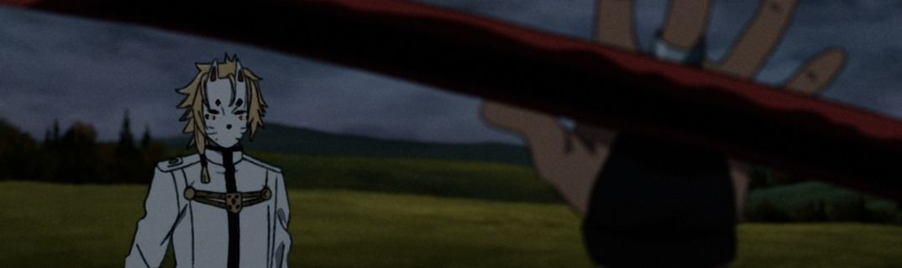

Tres cuartas partes de episodio prescindible, aunque anotamos unas cuantas cosas que vamos aprendiendo sobre el mundo:

- Han pasado dos años en los que Rudeus ha estado aprendiendo idiomas, hasta llegar la fecha de su décimo cumpleaños. El orbe flotante parece haber crecido de tamaño pero a nadie parece importarle. Ahí sigue.
- La familia **Greyrat** tiene cuatro ramas principales, enter las que están los Noto (**donde** están Paul y Rudeus) y los **Boreas** (quienes alojan a Rudeus ahora). Todos los varones Boreas deben ser educados por el cabeza de familia en la capital, y por eso los hermanos de Eris no viven en Roa, y su madre le tenía una cierta animadversión a Rudeus. 
- Eris le regala un báculo de mago a Rudeus por su cumpleaños, de nombre (los báculos tienen nombre, parece ser) **Aqua Heartia**.

La noche del cumpleaños tenemos otra escena tremendamente *creepy* entre Rudeus y Eris, que tienen 10 y 12 años respectivamente. Intento no pensar demasiado en esto, no sé que le pasa a esta cultura con estas cosas, pero no me gusta. Al final deciden dejarlo estar para cuando Rudeus cumpla 15 años, que al parecer es la mayoría de edad en este mundo.

Al día siguiente, mientras Rudeus, Eris y Ghislaine van a las afueras a probar el nuevo báculo, una gran nube oscura aparece sobre Roa y ya la hemos liado. Vemos a unos cuantos personajes para hacer recapitulación del estado actual y se nos presenta alguno nuevo:

- **Paul**, **Zenith** y **Sylph** siguen igual.
- **Roxy** sigue haciendo de maestra.
- Un señor raro junto a un dragón, aún no sabemos quién es.
- "El" gran emperador del mundo demoníaco: **Kishirika Kishirisu**. Seguimos teniendo problemas con las traducciones del género, porque lo que parece es una niña pequeña, pero creo que este nombre lo lleva también en inglés, quizá incluso en el japonés original, así que yo qué sabré.
- Quien parece ser el gran héroe **Perugius**, en su fortaleza volante, hablando con un subalterno llamado **Amalfi**, a quien manda a investigar.

Y en esas estamos cuando aparece Amalfi, el radiante, junto a nuestros protagonistas. Pensando que quizá tengan algo que ver con la gran nube y el problema mágico que parece estar sucediendo, intenta hacerles desistir de estar haciendo mágicamente el tonto en mitad de la nada... pero no, todo es una gran confusión. Y ¡pum! el orbe hace algo raro y una luz se traga a todo el mundo. Fin.

Como decía más arriba, esta serie tiene la mala y fea costumbre de tener puntos de inflexión en los que todo cambia y ya nos podemos ir olvidando de todos los personajes.

##### Episodio 9, Un encuentro fortuito

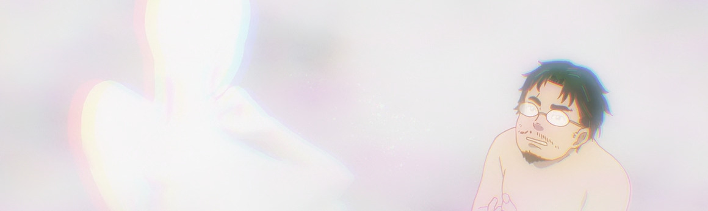

Aquí comienza una de las subtramas globales que más darán que hablar: nuestro protagonista comienza el episodio en un mundo... ¿"*astral*"? con su antiguo cuerpo pre-isekai, y se encuentra con un ente que queremos entender que es algún tipo de ¿deidad?

Un largo diálogo entre los dos nos hace pensar que no es él quien reencarnó a nuestro protagonista en este mundo (*no puede devolverle a un lugar fuera de "este mundo de seis caras"*), sino quizá "*el malvado Dios Dragón*". Explica que ha ocurrido un desastre de poder mágico, y se despertará en el continente demoníaco, muy lejos de su hogar. "*Cuando despiertes, verás a un hombre cerca de ti. Confía en él y haz lo posible por ayudarlo*". 

Y así comienza una nueva etapa: **Rudeus** y **Eris** han sido transportados al otro lado del mundo, y conocen a **Ruijerd Superdia**, un demonio de la tribu *Superd*, que promete ayudarles a volver a su país de origen.

El resto del capítulo transcurre comenzando el viaje, donde llegan al pueblo de la tribu Migurd donde viven los padres de Roxy (¡qué casualidad!), y conociendo la historia de Ruijerd: en la gran guerra de hace 400 años, Laplace unificó las tribus de demonios y regaló a los Superd unas lanzas malditas, que acabaron dominándolos y haciendo que atacaran a cualquiera, amigo o enemigo, padres, hijos y hermanos. Desde entonces se mantiene un miedo y odio hacia los Superd, y el objetivo de Ruijerd es acabar con esa mala reputación (está complicado). Rudeus promete ayudarle en su objetivo, y parten de viaje.

##### Episodio 10, El valor de la vida y el primer trabajo

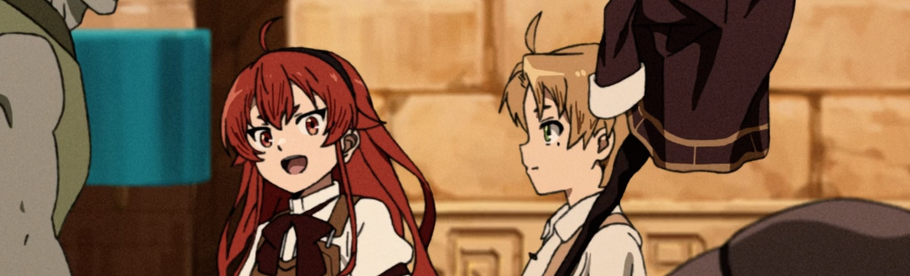

Llegan a la ciudad de **Rikarisu**, donde Ruijerd tiene que intentar pasar desapercibido, y se apuntan al gremio de aventureros para realizar misiones de nivel bajo con las que ganar algo de dinero. El misterioso Dios vuelve a aparecerse en sueños a Rudeus para ir dejándole sugerencias de lo que debe hacer.

##### Episodio 11, Los niños y los guerreros

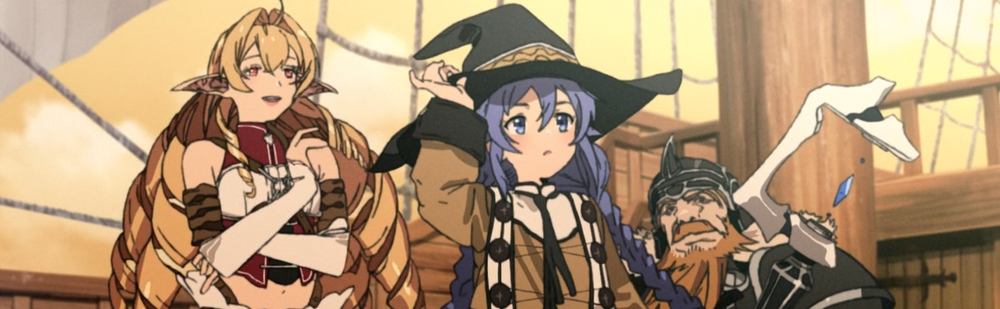

Otro año más ha pasado con nuestros protagonistas viajando por el continente demoníaco y haciendo misiones para el gremio de aventureros en varias ciudades, hasta llegar a la costa.

Sabemos que el desastre mágico no ha afectado a todo el mundo: vemos a Roxy, a Paul con Norn, y averiguamos que Zenith, Lilia y Aisha han desaparecido. Roxy y otros dos nuevos personajes de los que aún no sabemos nada parten en barco hacia la misma ciudad del continente demoníaco a la que ha llegado Rudeus, y con esa escena se termina la primera parte de la primera temporada.

### Primera temporada, segunda parte

##### Episodio 12, La Mujer con Ojos Mágicos

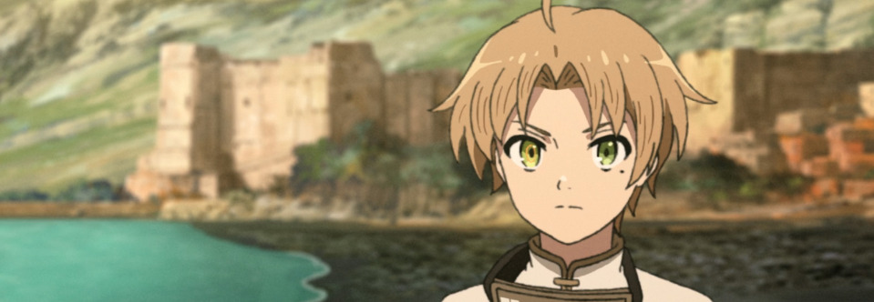

Gracias a otra recomendación en sueños del misterioso dios, Rudeus encuentra en la ciudad a **Kishirika Kishirisu**, a quien los espectadores ya conocimos hace algunos capítulos. En pago a un favor, Kishirika le da a Rudeus uno de sus ojos demoníacos con poderes: el **Ojo de la Adivinación,** con el que a partir de ahora Rudeus es capaz de predecir lo que sucederá en pocos segundos.

Dado que nadie quiere llevar en barco a un Superd, los protagonistas acuerdan que tendrán que viajar en algún barco de contrabandistas.

### Segunda temporada

Anunciada para algún momento de 2023, aún no estrenada.

## Enlaces de interés

- [Mushoku Tensei Wiki](https://mushokutensei.fandom.com/wiki/Mushoku_Tensei_Wiki).
