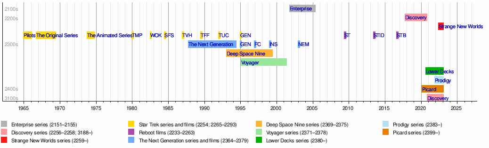

El blog **Crónicas de Taslar** (ya desaparecido) hizo hace unos años una guía de revisionado cronológico de todo [Star Trek](https://thetvdb.com/series/star-trek), incluyendo recomendación de qué era prescindible y qué no. Lo publicaron en un archivo *pdf* que lleva años dando vueltas por mis discos duros, y echando un vistazo he descubierto que estaba basado en la web [The Star Trek Chronology Project](http://thestartrekchronologyproject.blogspot.com/), que está actualizada. En los últimos tiempos he estado viendo algo de [Star Trek Picard](https://thetvdb.com/series/star-trek-picard) y [Lower Decks](https://thetvdb.com/series/star-trek-lower-decks), y me he animado a empezar por el principio con un **revisionado de todo Star Trek**. 

Probablemente es imposible que vaya a terminar algún día este "*proyecto*", ya que llevamos casi 800 capítulos sumando unas cosas y otras, pero aquí hemos venido a jugar. Y si voy  tomando notas de cada capítulo que vea, las probabilidades de que me anime a continuar son mucho mayores. Así que vamos a ello.

## Las Series

*[Wikipedia](https://en.wikipedia.org/wiki/Star_Trek): en 2023 están emitiéndose cinco series de Star Trek. Esto es una locura*.{.center}

Una lista de lo que tenemos por delante, actualizada a **Noviembre de 2023**:

| Serie | Temps | Eps | Emisión |
| ----- | :---: | :-: | ------- |
| [*Star Trek, La Serie Original*](https://en.wikipedia.org/wiki/Star_Trek:_The_Original_Series) | 3 | 79 | Sept 1966 – Junio 1969 |
| [*The Animated Series*](https://en.wikipedia.org/wiki/Star_Trek:_The_Animated_Series) | 2 | 22 | Sept 1973 – Octubre 1974 |
| [*La Nueva Generación*](https://en.wikipedia.org/wiki/Star_Trek:_The_Next_Generation) | 7 | 178 | Sept 1987 – Mayo 1994 |
| [*Deep Space Nine*](https://en.wikipedia.org/wiki/Star_Trek:_Deep_Space_Nine) | 7 | 176 | Enero 1993 – Mayo 1999 |
| [*Voyager*](https://en.wikipedia.org/wiki/Star_Trek:_Voyager) | 7 | 172 | Enero 1995 – Mayo 2001 |
| [*Enterprise*](https://en.wikipedia.org/wiki/Star_Trek:_Enterprise) | 4 | 98 | Sep 2001 – Mayo 2005 |
| [*Discovery*](https://en.wikipedia.org/wiki/Star_Trek:_Discovery) | 4 | 55 | Sept 2017 – **presente** |
| [*Short Treks*](https://en.wikipedia.org/wiki/Star_Trek:_Short_Treks) | 2 | 10 | Octubre 2018 – Enero 2020 |
| *[Picard](https://en.wikipedia.org/wiki/Star_Trek:_Picard)* | 3 | 30 | Enero 2020 – **presente** |
| [*Lower Decks*](https://en.wikipedia.org/wiki/Star_Trek:_Lower_Decks) | 4 | 40 | Agosto 2020 – **presente** |
| [*Prodigy*](https://en.wikipedia.org/wiki/Star_Trek:_Prodigy) | 1 | 20 | Octubre 2021 – **presente** |
| [*Strange New Worlds*](https://en.wikipedia.org/wiki/Star_Trek:_Strange_New_Worlds) | 2 | 20 | Mayo 2022 – **presente** |
| [*Very Short Treks*](https://en.wikipedia.org/wiki/Star_Trek:_Very_Short_Treks) | 1 | 5 | Sep 2023 – Oct 2023 |

Esta ordenación está hecha por fecha de emisión original, no por fecha estelar, es decir, el momento cronológico dentro del propio universo de **Star Trek** en el que sucede el contenido de cada capítulo. Durante mucho tiempo la serie original (la del *Capitán Kirk* de **William Shatner** y el *Doctor Spock* de **Leonard Nimoy**) fue la primera también cronológicamente, pero hay que tener en cuenta que casi toda **Enterprise** sucede casi un siglo antes que esto, ya que narra los acontecimientos de la primera misión de exploración del espacio profundo y la primera nave llamada *Enterprise*.

En los últimos tiempos, parcialmente **Discovery** y su *spin-off* **Strange New Worlds** suceden también poco tiempo antes de **La Serie Original**. Así que... ¿Por dónde empezar? En esto hay tantas opiniones como en el "*¿Cómo ver todas las películas de Star Wars?*", donde cada persona tiene su propia opinión... quizá es mejor verlas tal y como se estrenaron en cines, quizá es mejor ver primero las precuelas y luego... o quizá es mejor no ver según qué películas o... para gustos, colores.

Si queremos hacer el visionado por fecha de estreno, ahí está esa tabla, y podemos ir temporada a temporada. Como podéis ver en la gráfica de más arriba, **Deep Space Nine** se solapó durante poco tiempo con **La Nueva Generación** hasta que terminó, y más adelante con **Voyager**, por si queremos ir intercalando episodios. Y actualmente se están solapando cinco series, pero salvo **Discovery** y **Strange New Worlds** (y **Short Treks** si nos podemos completistas, que son cortos relacionados con estas tripulaciones), todas las demás no tienen nada que ver entre sí, así que podemos verlas como queramos.

Ahora bien, si queremos hacer el visionado cronológico, ni intentemos calcularlo. Vayamos directamente a la web hecha por *fans* a tal efecto: [The Star Trek Chronology Project](http://thestartrekchronologyproject.blogspot.com/), que está actualizada y ahí tendremos el orden tal y como debe verse, episodio a episodio, y con las películas intercaladas en su momento correcto.

## Las Películas

| Título | Elenco | Fecha |
| ------ | ------ | ----- |
| Star Trek: La película | *La Serie Original* | Dic 1979 |
| Star Trek II: La ira de Khan | *La Serie Original* | Junio 1982 |
| Star Trek III: En busca de Spock | *La Serie Original* | Junio 1984 |
| Star Trek IV: Misión: salvar la Tierra | *La Serie Original* | Nov 1986 |
| Star Trek V: La última frontera | *La Serie Original* | Junio 1989 |
| Star Trek VI: Aquél país desconocido | *La Serie Original* | Dic 1991 |
| Star Trek: La próxima generación | *La Nueva Generación* | Nov 1994 |
| Star Trek: Primer contacto | *La Nueva Generación* | Nov 1996 |
| Star Trek: Insurrección | *La Nueva Generación* | Dic 1998 |
| Star Trek: Némesis | *La Nueva Generación* | Dic 2002 |
| Star Trek | *Reboot (Kelvin Timeline)* | Mayo 2009 |
| Star Trek: En la oscuridad | *Reboot (Kelvin Timeline)* | Mayo 2013 |
| Star Trek: Más allá | *Reboot (Kelvin Timeline)* | Julio 2016 |

### La línea temporal Kelvin

Sobre las últimas películas de esa lista ya [escribí un poco hace tiempo](/lista-de-correo-de-neverbot-com-01/): en 2009 se produjo un... erm... *reboot*... recomienzo... un cambio en el universo **Star Trek** gracias a un viaje en el tiempo, creando una nueva línea temporal. En esta "realidad" nada de lo que conocemos (**La Serie Original**, **La Nueva Generación**... nada) ha sucedido, y todo vuelve a contarse desde que *Kirk* y *Spock* son jóvenes. 

[Esta primera película de 2009](http://www.imdb.com/title/tt0796366/) fue dirigida por [J. J. Abrams](http://www.imdb.com/name/nm0009190?ref_=tt_ov_dr). El abuelo de este señor se llamaba *Henry Kelvin*, aparentemente una figura de importancia durante su juventud, y desde entonces ha utilizado como guiño y homenaje la palabra Kelvin [en todas sus producciones](http://the-odi.blogspot.com.es/2008/10/abrams-explains-use-of-kelvin-in-his.html), en forma de huevo de pascua escondido. Tuvimos la nave *U.S.S. Kelvin* en [la primera película](http://www.imdb.com/title/tt0796366/), el [Kelvin Memorial Archive](https://www.youtube.com/watch?v=N7JGgdFRero) en [Into Darkness](http://www.imdb.com/title/tt1408101/). Y finalmente el *fandom* [acabó bautizando](http://screenrant.com/star-trek-jj-abrams-kelvin-timeline/) a esta "línea temporal" como la **línea temporal Kelvin**.

Podemos verlas, tienen su diversión, pero no encajan en un visionado cronológico con el resto porque son un reboot completo del universo. Podríamos hacer un visionado cronológico de la línea temporal Kelvin por su lado, que sería... ver las tres películas en orden y ya. *Win*.

## ¿Y cómo lo voy a hacer yo?

Pues una mezcla. Voy a empezar el visionado teniendo en cuenta la fecha de estreno (ya he empezado con **La Serie Original**), pero teniendo un ojo atento a la lista cronológica para saber lo que ocurre antes o después. ¿Por qué? Principalmente porque tampoco sé muy bien hasta donde voy a llegar o si voy a terminar el proyecto entero, pero tengo claro que sí quiero ver a la tripulación original en sus tres temporadas, así como las siete de **La Nueva Generación**, que es con lo que empecé yo como *Trekkie*. A partir de ahí, hasta donde nos lleve la imaginación.

## Registro personal

| Serie | Episodio | Fecha | Stardate | Título |
| :---: | -------- | ----: | -------: | ------ |
| TOS   | s00e01 | 30/1/2023 | 2254 / - | [The Cage (primer piloto)](/star-trek-el-episodio-piloto-perdido/) |
| TOS   | s01e01 | 2/2/2023 | 2266 / 1513.1 | [The Man Trap](/star-trek-la-serie-original-primera-temporada/#the-man-trap-(s01e01)) |

Leyenda:

- **TOS**: Star Trek, *The Original Series*, La Serie Original.
- **TAS**: *The Animated Series*.
- **TNG**: *The Next Generation*, La Nueva Generación.
- **DS9**: Deep Space Nine.
- **VOY**: Voyager.
- **ENT**: Enterprise.
- **DSC**: Discovery.
- **PIC**: Picard.
- **LOW**: Lower Decks.
- **PRO**: Prodigy.
- **SNW**: Strange New Worlds.
- *Short Treks* y las películas no tienen una abreviatura concreta.

## Enlaces de interés

- [Memory Alpha](https://memory-alpha.fandom.com), la wiki específica sobre todo **Star Trek**.
- En [tor.com](https://www.tor.com/) hicieron lo mismo: [Star Trek ReWatch](https://www.tor.com/series/star-trek-rewatch/).
- En el blog [Let's Watch Star Trek](https://www.letswatchstartrek.com) están en ello.
- [Artículo sobre la serie original en el blog C](https://www.ccyberdark.net/8964/star-trek-la-serie-original/).